# 02 - El nostre primer programa Scratch

Q.Serrano - <quique.srrn@gmail.com> - QODE66

## Finalitat

Primera presa de contacte amb _S4A Scratch_ per _Arduino_. Realitzarem
el nostre primer programa, ho carregarem en el nostre _Arduino_ i
comprovarem que funciona.

## Material

|                              Imatge                              | Descripció                                                           |
| :--------------------------------------------------------------: | :------------------------------------------------------------------- |
|     | Arduino Uno o compatible amb S4A i amb el firmware per S4A carregat. |
| 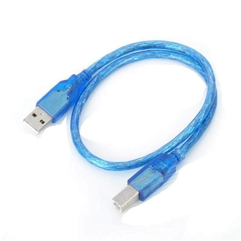 | Un cable USB adequat al connector del teu _Arduino_.                 |
|    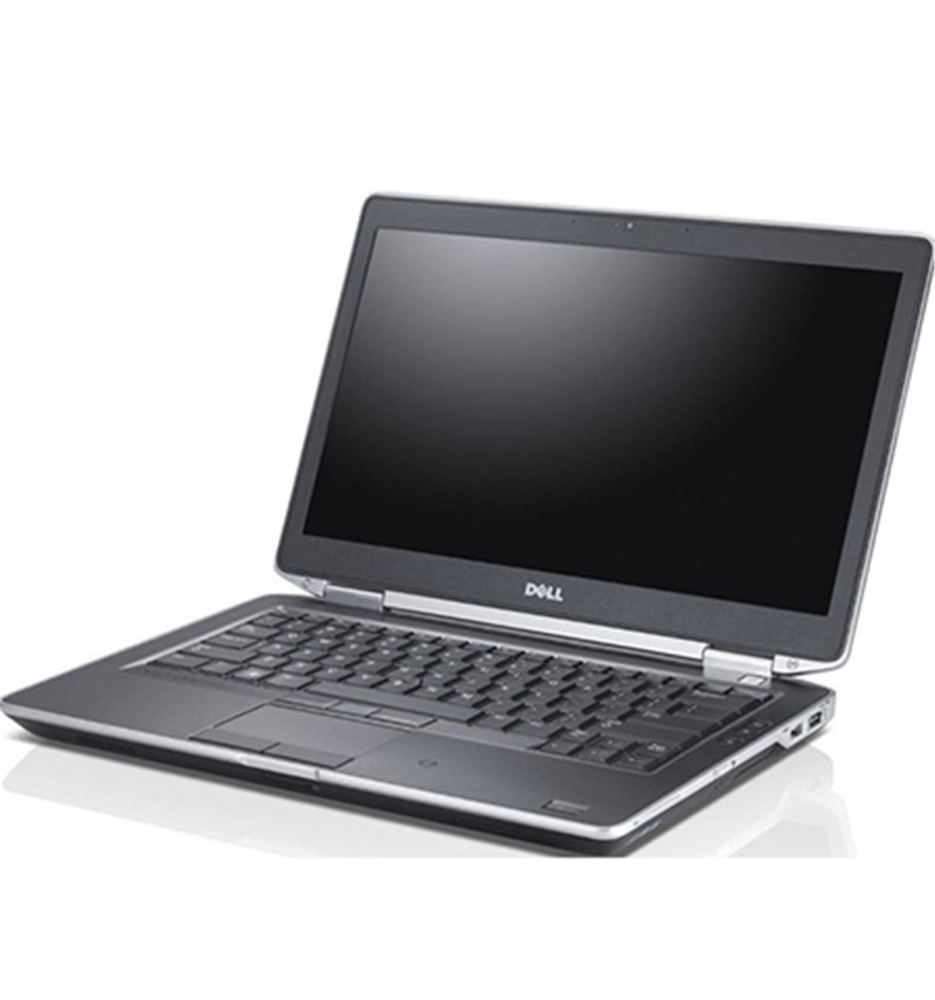    | Un PC amb l’entorn _S4A_ correctament instal·lat i configurat.       |

## Primers passos

No té cap sentit tractar d'explicar per a què serveixen cadascuna de les
opcions i blocs que trobem en l'entorn S4A, perquè probablement se us
oblidarien la majoria al de deu minuts (O menys, que ja ens coneixem).
Igual que la millor manera d'aprendre a caminar és caminant, la millor
manera d'aprendre a programar és anar programant a poc a poc.

De moment ens n'hi ha prou amb saber que en arrancar S4A ens trobem una
pantalla amb 5 zones diferents. Anirem explicant què són i per a què
serveixen cadascuna d'elles al llarg del curs.

1. Tipus de blocs.
2. Llistat de blocs d'una determinada categoria.
3. Contingut d'un objecte: programes, disfresses i sons.
4. Escenari.
5. Llistat d'objectes.

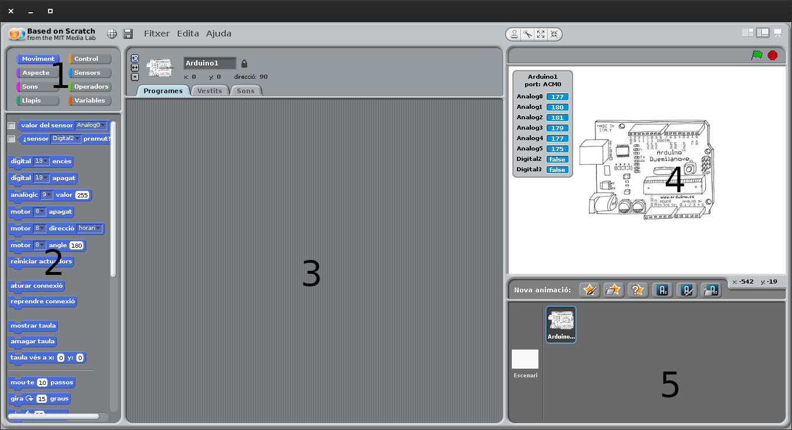

L'exercici típic per a començar a programar sol ser el blinking LED (LED
intermitent), perquè és fàcil de programar i il·lustra la capacitat de
Arduino per a interactuar amb el món exterior.

> :memo: **NOTA:** _És interessant destacar ací, els PCs de sobretaula als quals estem ja tan habituats, són rapidíssims i amb capacitats molt lluny de l'abast de Arduino i altres xicotets processadors de baix cost. Però en canvi, aquests són capaços d'interactuar amb el món exterior fàcilment alguna cosa que queda quasi fora de l'abast dels potents PCs._  
> _Aquesta capacitat d'interactuar amb l'exterior i no simplement realitzar operacions internes aïllades, ha sigut batejada com a computació física i obri unes possibilitats immenses, com les impressores 3D, els Drons i automatismes de tota mena._  
> _I fins i tot mes interessant, estan a l'abast de qualsevol amb interès i no fa falta ser enginyer per a comprovar-ho, com esperem poder-vos demostrar._

Arduino té diverses maneres de relacionar-se amb el món exterior.
Començarem per els pins digitals d'entrada i d'eixida.

Encara que les plaques Arduino tenen la capacitat d'utilitzar qualsevol
dels pins digitals com a entrada o eixida, en l'entorn S4A venen ja
predefinits:

- Entrades digitals: per a llegir informació digital del món exterior.
  En S4A corresponen als pins 2 i 3.
- Eixides digitals: per a enviar un senyal digital al món exterior. En
  S4A corresponen als pins 10, 11 i 13.

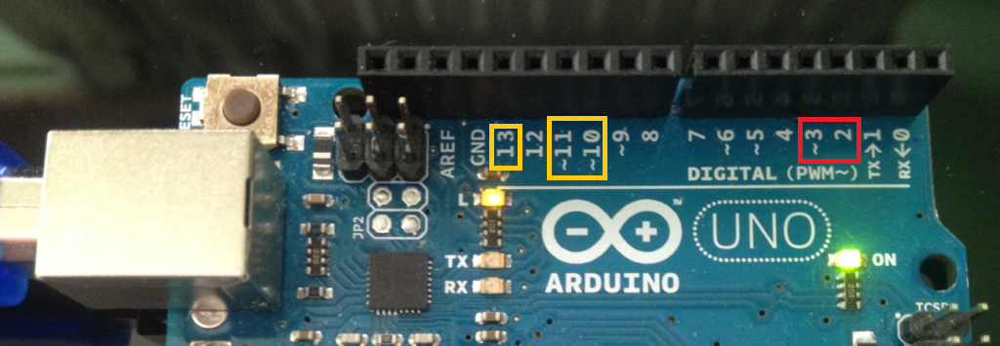

Els senyals digitals són aquelles que només poden prendre dos valors, 0
i 1 (HIGH i LOW). En Arduino corresponen a valors de 5V per a HIGH i 0V
per a LOW.

- Encara que al principi pot sonar estrany, moltes coses són digitals. Per exemple pots eixir de casa o no, però no hi ha un acabe intermedi.
- Pots aprovar si o no. Quan algú t'explica que no ha aprovat però en realitat és com si sí, sol acabar en recuperació.
- Aquesta dualitat tan senzilla és la base de funcionament de tota la computació actual encara que fins i tot us semble increïble.

## El nostre primer programa: Blinking led

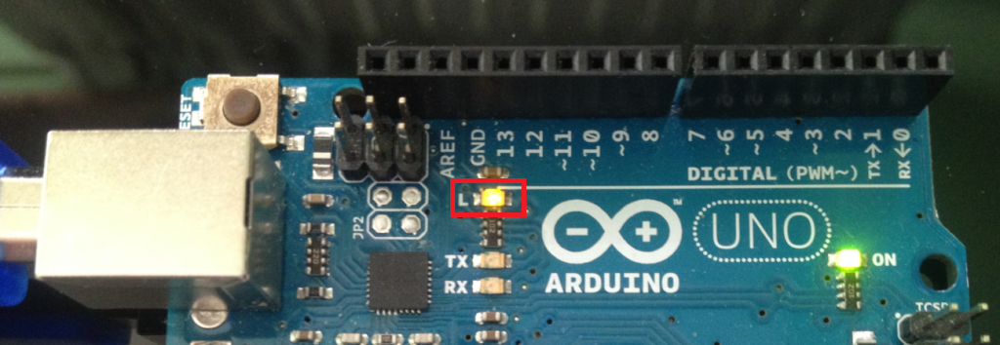

- El nostre primer programa serà un LED que parpelleja cada segon. Per a això utilitzarem l'eixida digital 13 perquè té connectat un LED directament en la placa Arduino. D'aquesta manera no haurem de realitzar cap muntatge i ens podrem centrar en explicar els blocs que compondran el programa i com carregar-lo en la placa.

Per a començar ens fixem en la part de dalt a l'esquerra del S4A. Ací és on es trien les diferents categories de blocs que hi ha.

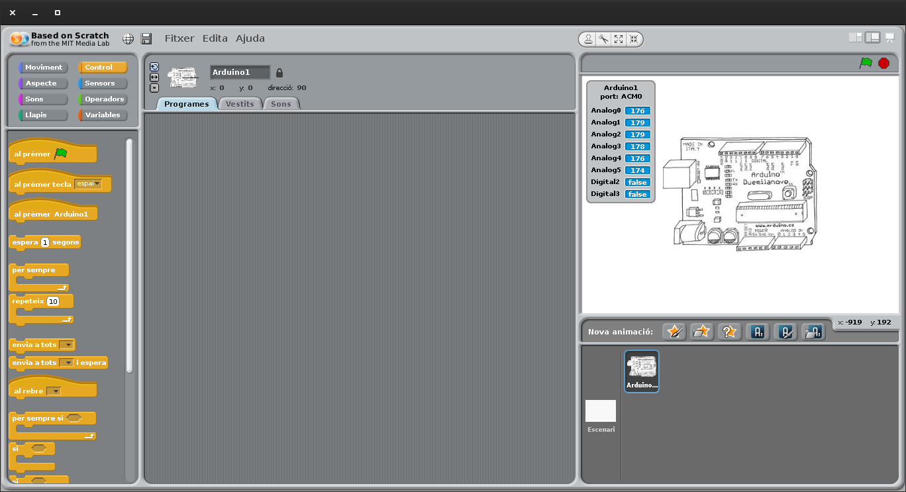

En aquest cas seleccionarem la categoria “_Control_” i veiem com davall
apareix la llista de blocs que entren dins d'aqueix grup de “_Control_”.

- Els blocs de “Control” són els que indiquen al nostre programa com i quan interpretar els altres blocs.
- Tots són de color groc.
- Si us fixeu en els blocs veureu que tenen una forma determinada a manera de peça d'un puzle.
- Només determinats blocs encaixen amb uns altres, la qual cosa ens ajudarà a l'hora de compondre les estructures dels nostres programes.

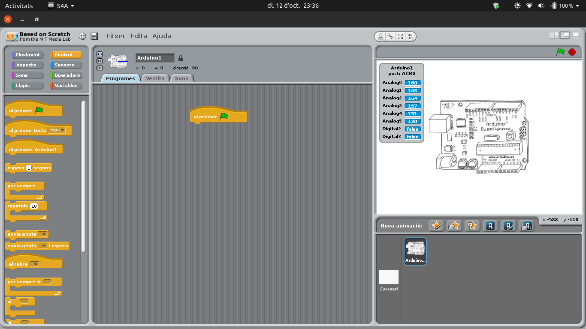

Normalment els programes els començaran amb el primer dels blocs (El de la bandera
verda) i tots els altres estan per davall d'aquest. Premem amb el botó
esquerre del ratolí damunt d'ell i l'arrosseguem cap a la part central
de S4A. Amb aquest bloc el que fem és que el programa s'execute quan
premem la bandera verda de la part de dalt a la dreta i fins que premem
el cercle roig.

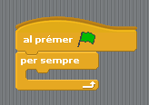

Com volem que el programa s'execute un nombre indefinit de vegades, agafarem
ara el bloc de control “per sempre”. Si ens fixem en la forma d'aquest
bloc veurem que la part de dalt encaixa amb la part de baix del bloc amb
el qual hem començat.

A més el bloc “per sempre” té un buit al mig en el qual podrem encaixar
altres instruccions, de manera que tot el que estiga dins d'ell
s'execute en seqüència fins al final. Una vegada que acaba, torna a
començar des del principi del bloc, fent un cicle sense fi.

El que farem ara és triar els blocs que enviaran els senyals a l'eixida
digital per a encendre i apagar el LED. Aquest tipus de blocs estan en
la categoria de “_Moviment_”.

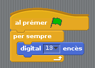

Dels blocs que apareixen utilitzarem els de _“digital 13 encès”_ i
_“digital 13 apagat”_. Primer agafarem “_digital 13 encès_” i ho fiquem,
arrossegant, dins de de el bloc “_per sempre_”.

Si en aquest punt donem a la bandera verda per a executar el programa,
veurem que el LED s'encén i es manté encès fins que parem el programa.

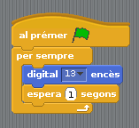

Desitgem que estiga encès dos segons, anem a la categoria “_Control_”,
seleccionem el bloc “_esperar 1 segons_”, i el posem a continuació de
“_digital 13 encès_”.

Amb això el que fem és que el programa es quede en la situació en la
qual està durant 1 segon (o el temps que nosaltres li indiquem).

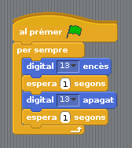

Com el que volem és que es apague ara i es mantinga apagat dos segons,
repetim el mateix però amb el bloc “_digital 13 apagat_”.

Ja hem acabat el nostre primer programa. Només ens queixa executar-ho i
veure si funciona correctament.

Per a això donem a la bandera verda, o també podem fer clic amb el botó
esquerre damunt de qualsevol dels blocs d'instruccions. Veurem que tots
els blocs del nostre programa i la bandera verda de l'escenari
s'il·luminen i el LED de la nostra placa Arduino comença a parpellejar
cada dos segons.

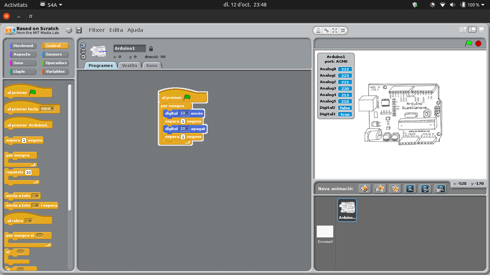

Finalment, i si volem guardar el nostre programa anirem a la pestanya “_Arxiu_”, i
li donarem a “_Guardar Com…_”. En aqueix menú tenim també les opcions de
“_Obrir_…” per a obrir un projecte que hàgem guardat anteriorment i
“_Guardar_” per a guardar l'arxiu damunt del que tenim obert.

També és interessant saber que en la pestanya “_Editar_” tenim l'opció
de “_Desfer_”, per si ens hem equivocat i volem tornar arrere.

## Conceptes importants

- L'estructura bàsica d'un programa.
- A seleccionar blocs i afegir-los al nostre programa.
- La importància de la forma i color dels blocs i com interactuen entre si.
- Com executar i parar un programa.

## Veure també

- [Contingut](../Contingut.md)
- [README](../README.md)
