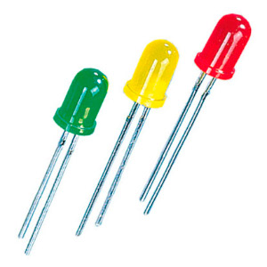
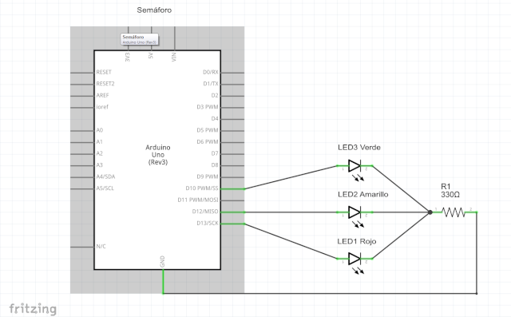
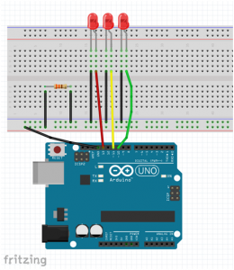
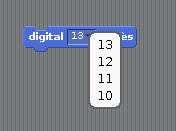
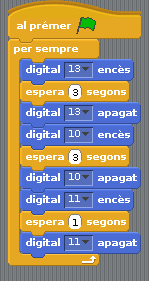
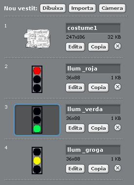
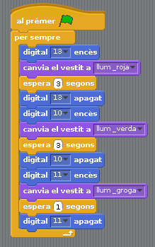

# S4A 05 - Circuit amb tres leds: semàfor

Q.Serrano - <quique.srrn@gmail.com> - QODE66

## Finalitat

La lliçó ens ensenyarà a muntar un circuit amb múltiples LEDs per a construir un semàfor, de manera que tindrem que utilitzar blocs d'eixida digital amb pins diferents. Al mateix temps, visualitzarem el semàfor en la pantalla del nostre PC i aprendrem a canviar el fons de l'escenari.

Tot açò comprenent el concepte d'algorisme.

## Material requerit

|                               Imatge                               | Descripció                                                           |
| :----------------------------------------------------------------: | :------------------------------------------------------------------- |
|       | Arduino Uno o compatible amb S4A i amb el firmware per S4A carregat. |
|  | Una protoboard                                                       |
|      | Cables de connexió                                                   |
|       | Tres díodes led                                                      |
|    | Una resistència de 330 Ohms                                          |

## Esquema electrònic del semàfor

En la sessió anterior vam veure com connectar correctament un LED. Ara complicarem una mica el circuit connectant tres díodes LED que s'encendran i apagaran per a construir el nostre propi semàfor.

Si hem entés el circuit amb un només LED, és fàcil entendre també aquest circuit. L'esquema electrònic seria el següent:

Esquema elèctric

- _Hem connectat cadascun dels díodes LED a diferents eixides digitals per a poder governar-los de manera independent._

- _Només necessitem una resistència perquè està en sèrie amb els tres díodes. El corrent que circule per qualsevol d'ells ho farà també per la resistència, de manera que protegirà als tres de cremar-se._

- _Tanquem el circuit connectant la resistència a GND. (negatiu de la alimentació)_

El muntatge del circuit en la placa protoboard seria el següent:

- _En general, es considera bon costum (la recomanem), muntar els circuits que vegem a partir de l'esquema electrònic d'aquest, més que a partir del diagrama de connexions de la protoboard._
- _La raó és que amb l'esquema, la comprensió del circuit és completa i s'evita la temptació de copiar la pràctica sense necessitat d'entendre-la._
- _A més, el diagrama electrònic del circuit és la seua completa descripció i sol resultar més senzill comprendre la funció d'aquest. En canvi a mesura que els circuits es fan més complexos,comprendre la seua funció des d'un esquema de protoboard pot complicar-se molt, i pitjor encara, portar a una interpretació errònia._

## Programació del semàfor

Un semàfor funciona de manera que s'encenen primer el roig, després el verd, i finalment el groc. Després tornaria a començar pel roig.

Per a programar el nostre semàfor no necessitem cap bloc que no hàgem usat abans. L'única novetat serà triar en el bloc "digital encés" i "digital apagat" l'eixida digital que vulguem utilitzar.

Començarem el programa amb els mateixos blocs de control que comencem la pràctica anterior, ja que volem que el semàfor funcione contínuament mentre estiga premuda la bandera verda.

El primer que volem fer és que s'encenga el LED roig durant 3 segons i després s'apague. Com és el que hem connectat a l'eixida digital 13, seleccionarem aqueixa eixida en els blocs de "Moviment" d'encendre i apagar.

En el bloc de "Control" de "esperar" li posem 3 segons.

- _No volem que passe temps entre que s'apague el LED roig i s'encenga el groc. Per això no necessitem posar un altre bloc de "esperar" després d'apagar._

Fem els mateix per al LED verd (pin digital 10) i per al groc (pin digital 11), amb l'excepció que el groc només volem que aquesta encesa 1 segon.

Si donem a la bandera verda per a executar el programa, veurem com funciona el nostre propi semàfor en la placa arduino.

## Visualització del semàfor en pantalla

Seguint el concepte de la pràctica anterior, tractarem de visualitzar el comportament del nostre programa en el nostre monitor.

Dibuixem les tres disfresses per a simular el nostre semàfor en la pantalla de l'ordinador, un per cada situació diferent de les que es donen.

Incloem els respectius blocs de "_Aparença_" "_canviar la disfressa a_" com hem aprés, i seleccionem que disfressa volem que usen.

## Resum de la sessió

En aquesta sessió hem aprés diverses coses importants:

- A utilitzar diverses eixides digitals en un mateix programa.
- A muntar un circuit electrònic una mica més complex.
- Com canviar el fons de l'escenari i adequar a ell els nostres objectes.
- Hem introduït el concepte d'algoritme com un procediment seqüencial per a resoldre un problema concret i l'hem aplicat a diversos exemples de programes senzills amb llums.\*\*

## Veure també

- [Contingut](../Contingut.md)
- [README](../README.md)
