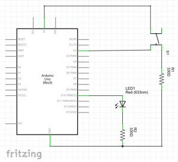
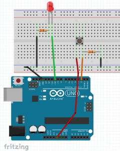
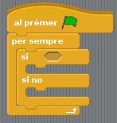
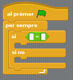
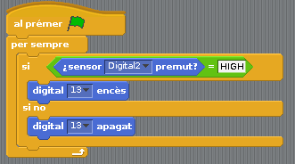

# 06 - Les entrades digitals de arduino

Anem a conéixer les entrades digitals de arduino i aprendrem a llegir un polsador. Presentarem els valors booleans que són unes dades molt utilitzades en la programació. A més veurem cóm crear estructures condicionals utilitzant el bloc de «Control» «si .../ si no».

## Material requerit

|                               Imatge                               | Descripció                                                           |
| :----------------------------------------------------------------: | :------------------------------------------------------------------- |
|       | Arduino Uno o compatible amb S4A i amb el firmware per S4A carregat. |
|  | Una protoboard                                                       |
|      | Cables de connexió                                                   |
|        | Un díode led                                                         |
|    | Dos resistències de 330 Ohms                                         |
|    | Un polsador                                                          |

## Les entrades digitals d'arduino

Amb freqüència en electrònica necessitem saber si una llum està encesa o apagada, si algú ha premut un botó o si una porta ha quedat oberta o està tancada.

A aquesta mena de senyals **tot/res, SI/NO, TRUE /FALSE, 0/1** se'n diu digitals o Booleanes.

Molts dels sensors i actuadors que veiem en el món real són digitals:

- Com a sensors digitals podem esmentar botons i polsadors, finals de carrera, desbordament de nivell, sensors de flames, fum o gasos tòxics. Els llegim mitjançant les entrades digitals. En S4A disposem dels pins digitals 2 i 3 que actuen com a entrada digital.
- Com a actuadors digitals, tenim llums, alarmes, sirenes o desbloqueig de portes. Els vam governar mitjançant les eixides digitals. Ja sabem d'altres sessions que en S4A són els pins digitals 10, 11 i 13.

En aquesta lliçó llegirem un botó o polsador extern (entrada digital) i s'encendrà o apagarà un LED (eixida digital) en funció que el polsador estiga pressionat o no.

## Esquema elèctric del circuit

Aquest circuit és una mica més complicat que els que hem vist fins ara. El muntatge del LED serà el mateix que en les sessions anteriors. En aquest cas el connectarem a l'eixida digital 10.

Per primera vegada utilitzarem el pin de 5V de la nostra placa arduino. A diferència de les eixides digitals, que poden donar HIGH o LOW, aquest pin sempre donarà HIGH.

Connectarem el polsador S1 al pin de 5V, i tancarem el circuit connectant l'altra part del polsador a l'entrada digital 2 i a GND a través d'una resistència.

D'aquesta forma quan el polsador es tanca obtenim 5V, HIGH, en l'entrada digital 2. Si està obert obtenim 0V, LOW. I llavors, per a què serveix la resistència R1?

Si llegim el valor d'una entrada digital que no té res connectat veurem com a vegades els valors en l'entrada fluctuen. Per a evitar-ho podem connectar una resistència PULLDOWN o PULLUP. Una resistència de PULLDOWN el que fa és garantir que quan el botó no està premut, es llija sempre
LOW, és a dir, fixa la tensió a 0V. Per contra, una resistència de PULLUP garanteix que el valor llegit és HIGH, per tant 5V.

- _Aquesta resistència és clau perquè les lectures del polsador siguen consistents. El circuit, simplement, no funcionarà bé si s'omet._

Nosaltres hem realitzat el muntatge amb la resistència en PULLDOWN. Mentre no pressionem el polsador, romandrà obert, és a dir que no deixarà que circule el corrent a l'altra part. D'aquesta manera el que tenim és el pin 2 connectat a GND a través de la resistència R1, de
manera que llegirà LOW.

En tancar-ho el que fem és tancar el circuit del pin 2 a 5V, amb el que llegirà HIGH.

El muntatge en la protoboard seria el següent:

- En aquest esquema hem seguit la pràctica habitual d'usar cables negres per a connectar a GND i cables rojos per a connectar a HIGH (5V).
- Hem utilitzat cable taronja per a l'entrada digital i cable verd per a l'eixida, amb la intenció diferenciar-les fàcilment.
- El polsador S1 té quatre pins (l'element que està sobre la resistència). Això és perquè cada entrada de l'interruptor té dos pins connectats. En el nostre circuit simplement hem ignorat els
  pins secundaris, però podeu utilitzar-los igualment per a la connexió.

## Aprenent a llegir el polsador

Per a llegir el polsador utilitzarem usar un nou bloc de "_Control_" "si ... / si no".

El comportament d'aquest bloc és el següent:

- Si es compleix la condició que li posem dins de l'espai en forma d'hexàgon, el programa executarà els blocs que estiguen dins del "si ..." fins a arribar a "si no", i se saltarà tot el que hi haja dins de "si no".
- Si no es compleix, se saltarà tots els blocs que estiguen dins de "si ..." i executarà els blocs que estiguen dins de "si no" fins al final.

El primer que farem serà crear la condició. Per a això utilitzarem els blocs de la categoria "Operadors". Com en aquest cas el que volem és crear una condició que comprove el valor d'un senyal digital usarem el bloc de "Operadors" "... = ...". Ho seleccionem i ho arrosseguem fins al
buit en forma d'hexàgon.

Per a acabar de crear la condició hem de decidir què és el que volem comparar. En aquest cas el que volem saber és si l'entrada digital 2 està llegint HIGH o LOW. El bloc per a llegir entrades digitals està en la categoria "_Moviment_".

Encara que en aquest bloc sembla que el que comparem és si està pressionat, això dependrà del circuit. Seria millor que ho interpretàrem simplement com a "_valor sensor digital ..._"; i veure quin valor realment està rebent aqueixa entrada digital.

- Recordem que hem muntat el circuit amb la resistència connectada en PULLDOWN, de manera que si el polsador està premut l'entrada llegirà HIGH.
- En aquesta mena de comparacions LOW correspon a false i HIGH a true.
- Si haguérem connectat la resistència en PULLUP, l'entrada "sensor digital ... pressionat" llegiria HIGH o true quan amb el polsador sense pressionar. És important entendre com funciona en realitat, i així no tindrem por de muntar o interpretar cap circuit electrònic.

Si hem entés això últim, hauríem de tindre més o menys clar que el que volem aconseguir amb aquest bloc és una cosa així:

- Si el pin 2 està connectat a **_LOW_** (**_false_**), volem que el LED estiga apagat. Això vol dir que mentre no pressionem el polsador, el LED romandrà apagat.
- Si el pin 2 està connectat a **_HIGH_** (**_true_**), volem que el LED s'encenga. És a dir que mentre pressionem el polsador, el LED romandrà encés.

Segons siga el cas, executarem la ordre «_digital 13 encès_» o «_digital 13 apagat_»

## Resum de la sessió

En aquesta sessió hem aprés diverses coses importants:

- Què són i com s'utilitzen les **entrades** **digitals**.
- Les diferents opcions per a connectar correctament un **polsador**.
- Hem vist que existeixen **blocs** **de** **condicions** amb els quals decidir si s'executen o no certes instruccions.
- A fer condicions amb valors **booleans** o **digitals**.

## Veure també

- [Index](../Index.md)
- [README](../README.md)
