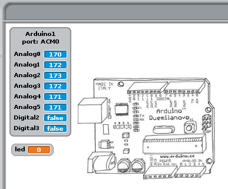

# 07 - Les variables en s4a

## Finalitat

En la lliçó es presentarà el concepte de condicions inicials i s'introduiran els blocs de «Variables». També aprendrem una mica més dels blocs «Operadors» a més d'aprofundir en el maneig dels blocs de control. Tot açò ens permetrà millorar la nostra capacitat per a crear algorismes i programes més complexos.

## Material requerit

|                               Imatge                               | Descripció                                                           |
| :----------------------------------------------------------------: | :------------------------------------------------------------------- |
|       | Arduino Uno o compatible amb S4A i amb el firmware per S4A carregat. |
|  | Una protoboard                                                       |
|      | Cables de connexió                                                   |
|         | Un díode led                                                         |
|    | Dos resistències de 330 Ohms                                         |
|    | Un polsador                                                          |

## Plantejament de l'algorisme: condicions inicials

L'esquema i el muntatge són els mateixos que els dels del programa del polsador de la sessió 6. La diferència és que en aquesta ocasió utilitzarem el polsador com un interruptor, de manera que una pulsació encenga el LED i la següent l'apague.

Construirem el programa de manera que sempre que comencem a executar el programa el LED estiga apagat. Per a això haurem de fer que en iniciar-se el programa s'execute el bloc "_digital 10 apagat_" una sola vegada, i després ja s'execute la resta de manera cíclica fins que ho parem.

Com volem que s'execute una única vegada, ho posarem davall del bloc "_en pressionar_" i abans del bloc "_per sempre_".

A aquesta mena d'estructura li direm **condicions inicials**, ja que només s'executa només una vegada i en iniciar-se el programa.

## Utilització de variables

Per a poder encendre o apagar el LED depenent de l'estat en què es trobe, el primer que hem d'aconseguir és saber en tot moment quin és l'estat de l'eixida digital 10. Per a això introduirem el concepte de **variable**.

- Una variable ens permet guardar un valor per a utilitzar-lo quan el necessitem.
- En aquest cas usarem una variable per a guardar l'estat de l'eixida digital 10 i d'aqueixa forma saber si el LED està encés o apagat.

Per a crear una variable nova anirem a la categoria de blocs "_Variables_" i farem clic en "_Nova variable_". Ens demanarà un nom. Com la volem per a guardar l'estat del LED, la cridarem simplement "_led_".

En acceptar veurem que se'ns creen nous blocs relacionats amb la variable led que acabem de crear, i en **l'escenari** se'ns mostrarà el valor que té emmagatzemada la variable. Podem arrossegar-la per a col·locar-la on vulguem.

Com necessitem saber en tot moment en quin estat es troba el LED, el que farem serà fixar el valor a 'false' quan l'eixida digital 10 estiga a LOW (LED apagat), i a 'true' quan ho estiga a HIGH (LED encés).

- Recordeu que una eixida digital és un **_valor booleà_**, només pot prendre dos valors, per això la nostra variable també serà booleana i prendrà només dos valors, true o false.

Ara ja volem que la resta d'instruccions s'executen de manera cíclica si compleix certa condició. Per a ells utilitzarem el bloc de "_Control_" "_per sempre si..._", que combina en un sol bloc els blocs "_per sempre_" i "_si..._".

Per a detectar quan s'acciona el polsador crearem una condició igual a la que vam fer en la sessió anterior.

- Recordeu que l'eixida digital 2 llig HIGH(true) quan estrenyem el polsador perquè hem realitzat el muntatge amb la resistència en **_PULLDOWN_**.
- D'aquesta forma els blocs que estiguen dins del bloc "per sempre si..." s'executaran una vegada si es pressiona el polsador.
- Podeu provar de muntar el circuit amb la resistència en **_PULLUP_** com expliquem en la sessió 6.

Fins ara el nostre programa coneix l'estat del LED en iniciar-se el programa i detecta cada vegada que pressionem el polsador.

El que ens falta és que siga capaç d'encendre el LED si està apagat i d'apagar-lo si està encés. Per a això haurem d'usar el bloc de "_Control_" "_si / si no_" per a comprovar l'estat de la variable "_led_" que hem creat.

- Hem utilitzat el bloc de "**Variables**" "_led_". Aquest bloc té emmagatzemat l'últim valor que ha agafat la variable.
- Hem utilitzat l'operador _"... = ..."_ per a saber si ha guardat HIGH o LOW (true o false), ja que aquesta variable pren valors **booleans**.

Comparem el valor de la variable «led» amb uns dels valors booleans «true o false», en aquest cas ho fem amb «false».

Si la comparació és certa, és a dir, «led» té el valor «false»; s'executarà el bloc «si» i, com que quan «led = false» l'eixida digital 10 està apagada, farem el contrari, fixarem el valor de «led» a «true» i «digital 10 a encés». El bloc «si no» en aquest cas s'ignora.

Si la comparació és falsa, el que és el mateix «led» conté el valor «true»; se salta el bloc «si» i s'executa el bloc «si no», on fem que la variable prenga el valor «false» i «digital 10 apagat».

## Resum de la sessió

En aquesta sessió hem aprés diverses coses importants:

- El concepte de condicions inicials.
- Perquè serveixen les variables i com utilitzar-les.
- A crear algorismes més complexos.
- Comprendre una mica millor com es relacionen l'entorn S4A i el
  nostre Arduino.

## Veure també

- [Index](../Index.md)
- [README](../README.md)
