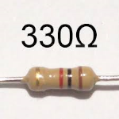
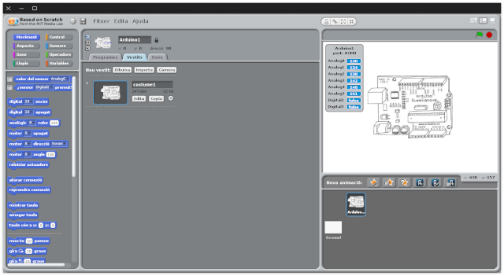

# 08 - POLSADOR VIRTUAL

## Finalitat

En aquesta lliçó aprendrem a utilitzar un polsador virtual en la
pantalla del PC. Ens familiaritzarem amb el concepte d'objecte i
coneixerem una mica millor l'escenari.

## Material

|                               Imatge                               | Descripció                                                           |
| :----------------------------------------------------------------: | :------------------------------------------------------------------- |
|       | Arduino Uno o compatible amb S4A i amb el firmware per S4A carregat. |
|  | Una protoboard                                                       |
|      | Cables de connexió                                                   |
|         | Un díode led                                                         |
|    | Una resistència de 330 Ohms                                          |

## Esquema electrònic

Per a aquesta lliçó utilitzarem el mateix circuit de la lliçó "03 - El
nostre primer circuit". Només necessitem el LED perquè simularem un
polsador virtual en la pantalla del PC.

D'aquesta manera comprovarem com en fer clic en el polsador virtual, es
encen el LED físicament, a més d'en l'escenari de S4A.

## Concepte d'objecte

Encara que fins ara no hem parlat d'ells, ja hem utilitzat objectes en
totes les sessions anteriors. Ho podem veure més clarament en les
sessions 4 i 5, en les quals mostràvem les disfresses dels objectes en
l'escenari.

En les altres sessions no hem necessitat crear més objectes perquè només
necessitàvem representar un en l'escenari, un LED o un semàfor. Ara
necessitarem crear un objecte nou que usarem com a polsador.

Sempre que comencem un programa nou se'ns crea per defecte un objecte
que inclou el vestit en el qual hi ha dibuixada una placa Arduino al
qual anomena Arduino1. Podem veure quants objectes diferents hi ha en
l'escenari del nostre programa en el llistat d'objectes de la part
inferior dreta de la pantalla de S4A.

El primer que farem serà modificar les disfresses de l'objecte que ve
creat per defecte igual que en la lliçó 4, amb les dues disfresses
"led_off" i "led_on".

Després esborrarem el vestit "costume1" amb la "x" que hi ha a la
dreta de el vestit i canviarem el nom de l'objecte a "Led".

- Encara que no és estrictament necessari canviar el nom de l'objecte ni esborrar el vestit que no usarem, això ens ajudarà a tindre el programa més net i ordenat.
- L'ordre i la neteja són uns bons costums que hauríem de mantindre al llarg de totes les sessions.
- Si més tard comencem a programar amb codi en comptes de blocs, serà encara més important.

En l'escenari haurà canviat l'objecte "Arduino1" per l'objecte "Led"
que hem creat.

## Com crear el polsador virtual

Farem un objecte nou per a simular un polsador i utilitzar-lo com un
interruptor, de la mateixa forma que vam fer en la lliçó 7 amb un físic.

Per a això en el llistat d'objectes donarem a a la icona "Pintar un
objecte nou". Automàticament ens obrirà l'editor gràfic i dibuixarem o
importarem un polsador.

Quan li donem a acceptar veurem que se'ns haurà creat un nou objecte
amb el nom de "**Animació1**" i una disfressa amb el dibuix que hem fet
amb el nom "**vestit1**".

- Si en crear-ho ens apareix en l'escenari muntat sobre el LED o en una posició que no ens agrada, podem fer clic en ell i arrossegar-ho a una altra part de l'escenari.
- Canviarem el nom de l'objecte a "Polsador" i el nom de el vestit a "polsador", de la mateixa forma que hem fet amb l'objecte Led.

### Programant el polsador

En S4A cada objecte que fem pot tindre el seu propi programa per a guiar
el seu comportament i comunicar-se amb els altres objectes. El primer
que farem serà seleccionar l'objecte" Polsador" en el llistat
d'objectes i anar a la pestanya "Programes".

El que volem és que en fer clic en el polsador en l'escenari, envie un
senyal a la resta d'objectes.

Utilitzarem el bloc de "Control" "en pressionar Polsador" per a començar
el programa, així cada vegada que el premem en l'escenari, durà a terme
les accions que li hàgem programat.

Com volem que en prémer-ho envie un senyal als altres objectes
utilitzarem el bloc "enviar a tots".

- En el menú desplegable seleccionarem "nou", i en el nom del missatge escriurem "on" (podeu posar-li el nom que vulgueu).
- Col·locarem el bloc en el programa davall de "en pressionar polsador".

## Programa led

Una vegada hem programat l'objecte Polsador seleccionem l'objecte Led
on construirem la part principal del nostre projecte.

El programa serà molt semblant al de la lliçó 7, però s'executarà cada
vegada que reba el senyal "on" del polsador que hem creat. Aquest bloc
substituirà a la condició en la qual comprovàvem si el polsador estava
pressionat de la lliçó 7:

- Necessitarem crear una variable "led" igual per a emmagatzemar l'estat del LED, que si l'hem connectat igual que en la lliçó 3, estarà connectat al pin digital 13.
- Crearem una condició "si / no" de la mateixa manera que vam fer en la lliçó 7.
- En aquest cas inclourem els blocs de "Aparença" per a canviar les disfresses de l'objecte "Led".

Aquesta vegada no necessitem prémer la bandera verda, si no que cada
vegada que fem clic en el nostre **polsador virtual**, el LED
s'encendrà o apagarà tant en l'escenari com físicament en la
protoboard.

## Resum de la lliçó

En aquesta lliçó hem aprés diverses coses importants

- L'escenari pot contindre diversos objectes amb els seus propis programes.
- Es pot simular una entrada digital amb un polsador virtual.
- Com fer que es comuniquen els objectes entre si.

## Veure també

- [Index](../Index.md)
- [README](../README.md)
