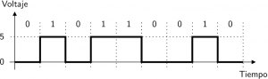
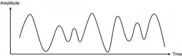
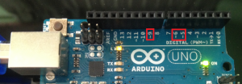
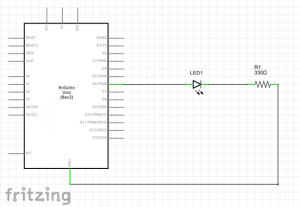
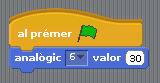
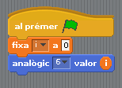
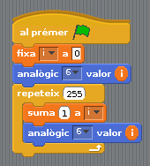
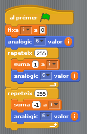
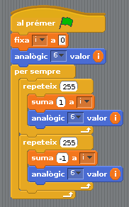

# S4A 09 - Eixides analògiques

## Finalitat

La lliçó ens servirà per comprendre la diferència entre analògic i digital, es presentaran les eixides analògiques i crearem estructures de repetició.

## Material

|                               Imatge                               | Descripció                                                           |
| :----------------------------------------------------------------: | :------------------------------------------------------------------- |
|       | Arduino Uno o compatible amb S4A i amb el firmware per S4A carregat. |
|  | Una protoboard                                                       |
|      | Cables de connexió                                                   |
|         | Un díode led                                                         |
|    | Una resistència de 330 Ohms                                          |

## Analògic i digital

Tots els senyals que hem manejat fins ara, tant d'entrada com d'eixida, han sigut digitals. Com ja sabem, aquest tipus de senyals només poden prendre dos valors, HIGH o LOW, 0 o 1.

Fins ara hem utilitzat aquest tipus de senyals per a encendre o apagar un LED o llegir si un polsador està pressionat o no. De fet, molts dels elements que existeixen són d'aquest tipus, com una alarma o un sensor de presència.

No obstant això existeixen moltes altres coses que poden prendre qualsevol valor dins d'uns límits. Si el que volem és, per exemple, llegir la temperatura, controlar la intensitat de la lluentor d'un LED o la velocitat de gir d'un motor, necessitarem dels **senyals analògics**.

En aquesta sessió utilitzarem una eixida analògica per a controlar la intensitat de la lluentor d'un LED.

## Les eixides analògiques

En realitat, les plaques Arduino (excepte la Arduino Duo) manquen d'eixides analògiques pures, però utilitzen un truc per a aconseguir que una eixida digital es comporte com una analògica.

- No entrarem a explicar-ho, però si us interessa es diu Pulse Width Modulation, PWM.
- Podeu buscar-ho en la sessió equivalent d'eixides analògiques del curs de Arduino d'aquesta mateixa pàgina.

És important saber això perquè ara no se'ns faça estrany saber que les eixides analògiques de Arduino en S4A corresponen als pins digitals 5, 6 i 9.

- Les eixides analògiques de Arduino UNO poden prendre valors entre 0 i 255, i en funció d'aqueix valor envien un senyal el valor del qual estarà entre 0V i 5V.
- Si per a algun projecte necessitem més eixides digitals que les tres que coneixem, podem usar les eixides analògiques, utilitzant el valor 0 per a LOW i el 255 per a HIGH.

## Controlant la lluentor d'un led

El circuit electrònic és el mateix que el del blinking LED de la sessió 3, però en aquest cas connectarem el LED a una de les eixides analògiques. En aquest cas hem triat la 6.

Per a assignar un valor a les eixides analògiques utilitzarem el bloc "analògic ... valor ..." de la categoria "Moviments". Seleccionarem l'eixida analògica 6.

Veiem que podem assignar-li el valor que vulguem. Si provem de ficar valors, entre 0 i 255, veurem com el LED s'il·lumina amb major o menor intensitat en funció del valor que li fiquem.

Ara farem un programa que encenga i a apague el LED a poc a poc, és a dir, que faça prendre a l'eixida analògica tots els valors des de 0 a 255 i després faça el mateix des de 255 a 0.

Per a poder anar variant el valor de l'eixida crearem una variable a la qual anomenarem "i". La idea és que l'eixida prenga sempre el valor d'aquesta variable i anar incrementant-la d'1 en 1 fins a 255, per a després anar disminuint-la també d'1 en 1 fins a 0.

El primer que farem és fixar les condicions inicials, fixem el valor de la variable "i" a 0 i assignem el valor d'i l'eixida analògica 6.

Ara haurem d'aconseguir fer una estructura que sume 1 a la variable i li ho assigne a l'eixida analògica. Com volem que arribe fins a 255, haurem de fer que es repetisca 255 vegades.

- Per a repetir una acció un nombre determinat de vegades usarem un nou bloc de "Control", el bloc "repetir ... ".
- Perquè cada vegada que es repetisca sume 1 a la variable "i", usarem el bloc de "Variables" "sumar ... a ..." i seleccionarem la variable "i" i li indicarem que sume 1.
- És important que faça la suma abans d'assignar el valor a l'eixida, o en cas contrari repetiria el valor 0 i només arribaria a 254.

Per a fer que es vaja apagant a poc a poc farem el mateix però en comptes de sumar-li 1, li sumarem -1.

Si provem d'executar el programa ara, veurem que el LED s'il·lumina a poc a poc fins a arribar al màxim i després va apagant-se a poc a poc una sola vegada. Si volem que faça això contínuament només hem de ficar tots els blocs, excepte les condicions inicials, dins del conegut bloc "_per sempre_".

- Recordeu que podem veure el valor que té la variable en tot moment, i per tant l'eixida analògica 6, en la taula de resum de valors de l'escenari.

## Resum

En aquesta sessió hem aprés diverses coses importants:

- La diferència entre analògic i digital
- Com usar les eixides analògiques de Arduino.
- A controlar el valor de les eixides analògiques mitjançant variables.
- Com crear estructures de repetició més complexes.

## Veure també

- [Contingut](../Contingut.md)
- [README](../README.md)
