# S4A 10 - Díode LED RGB

## Finalitat

Lliçó dedicada a aprofundir en l'ús dels pins analògics, a conèixer el funcionament dels leds RGB i aprendre a generar valors aleatoris.

## Material

|                               Imatge                               | Descripció                                                           |
| :----------------------------------------------------------------: | :------------------------------------------------------------------- |
|       | Arduino Uno o compatible amb S4A i amb el firmware per S4A carregat. |
|  | Una protoboard                                                       |
|      | Cables de connexió                                                   |
|  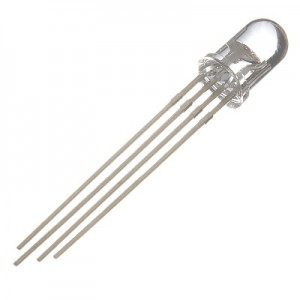   | Un díode led RGB                                                     |
|    | Una resistència de 330 Ohms                                          |

## Els díodes RGB

Fins ara els díodes LED que hem usat tenien un color determinat. Habitualment els més fàcils de trobar en electrònica són els de color roig, però podem trobar-los de molts més colors.

No obstant això, imagineu que necessitem que un LED varie de color en funció de la temperatura que hi haja en una sala; que estiga blau quan faça fred, vaja canviant cap a groc per a una temperatura normal i arribe al roig si se sobrepassa un determinat valor.

Podríem posar diversos LEDS de diferents colors, però el més senzill seria recórrer a un díode RGB. Aquest tipus de díodes tenen en un mateix encapsulat un LED de cadascun dels colors bàsics, roig, verd i blau (Red, Green, Blue), d'ací el seu nom, i comparteixen un càtode comú (_Ground_).

- La connexió d'aquesta mena de LED es realitza mitjançant quatre pins, un per cada color i un altre per a GND.
- En funció del valor de tensió que reba cada pin R, G, B, aconseguirem un color diferent.
- A partir d'aquests tres colors bàsics es pot aconseguir qualsevol altre color.
- No intenteu fer això pintant en un foli, perquè només funciona amb la llum.

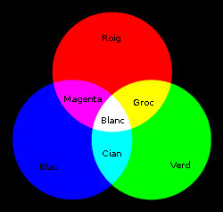

## Esquema electrònic

L'esquema electrònic és molt semblant al del semàfor de la lliçó 5, però utilitzant les **eixides analògiques**, i en comptes dels tres Leds, el díode RGB.

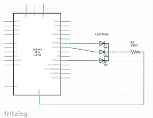

Per a identificar cadascun dels pins el millor seria llegir-se les especificacions del fabricador, encara que el més normal és:

- El pin més llarg és el GND.
- Tenint això en compte, el que queda aïllat al costat del GND és el roig.
- L'altre pin pegat al càtode és el verd.
- Per tant el patillatge del díode RGB quedaria R, GND, G, B.

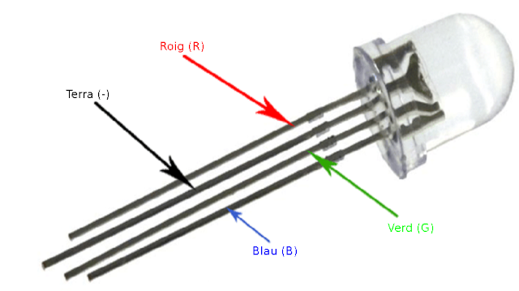

Si teniu un díode RGB amb muntura Keyes, com el que ve en el kit d'aquesta pàgina, no tindreu problemes ja que cada pin ve convenientment identificat.

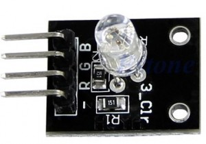

El muntatge en la protoboard quedaria així:

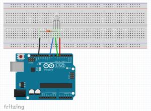

- Hem utilitzat cables de colors per a identificar cada pin amb facilitat.
- Si utilitzeu un RGB amb muntura Keyes, podeu connectar-ho directament a la protoboard o usar cables de mascle a femella.

## Controlant el RGB

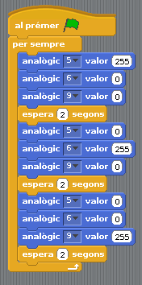

El primer que farem serà un programa molt simple en el qual assignarem a mà un valor a cadascuna de les **eixides analògiques** connectades al RGB per a comprovar que està ben connectat.

Farem que s'il·lumine roig, després verd i després blau, mantenint cada color 2 segons. Per a aconseguir cada uns dels colors posarem el seu pin corresponent a 255 i els altres a 0.

Si volem aconseguir un color determinat podem consultar el programa Paint si utilitzem Windows o qualsevol programa semblant de Linux o Mac.

En arrancar el programa, buscarem l'opció d'editar colors:

Si en aquesta pantalla seleccionem un color, veurem en la part inferior dreta el valor que correspon a cadascun dels **colors primaris**.

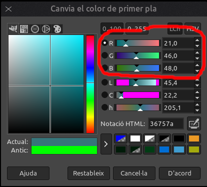

Si fiquem aqueixos valors en les nostres eixides analògiques, aconseguirem que el nostre LED RGB s'il·lumine en un to blavenc.

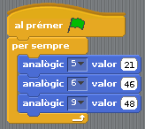

## Generant colors aleatoris

Aprofitarem el muntatge per a presentar un nou bloc que serveix per a generar **valors aleatoris**. És el bloc de tipus "\*Operadors" "numero a l'atzar entre ... i ...".

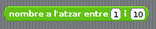

- Col·loquem aquest bloc en el lloc en què ficàvem a mà els valors.
- Com els valors que poden prendre estan entre 0 i 255, els posarem com a límits en lloc d'1 i 10.
- Farem que espere 1 segon després de cada execució per a fixar-nos bé en el canvi de color.

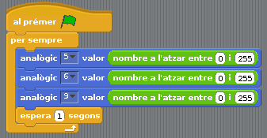

## Resum de la lliçó

En aquesta lliçó hem aprés diverses coses importants:

- A utilitzar correctament un díode LED RGB.
- Hem aprofundit en l'ús de les eixides analògiques.
- A utilitzar un nou bloc per a generar valors aleatoris.

## Veure també

- [Index](../Index.md)
- [README](../README.md)
