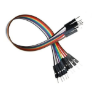

# Entrades analògiques i potenciòmetres

## Objectiu

La present sessió en servirà per conèixer els potenciòmetres, comprendre el funcionament de les entrades analògiques i utilitzar una entrada analògica per a controlar un objecte en l'escenari.

## Material

|                                Imatge                                 | Descripció                                                           |
| :-------------------------------------------------------------------: | :------------------------------------------------------------------- |
|          | Arduino Uno o compatible amb S4A i amb el firmware per S4A carregat. |
|     | Una protoboard                                                       |
|         | Cables de connexió                                                   |
|            | Un díode led                                                         |
|       | Una resistència de 330 Ohms                                          |
|  | Un potenciòmetre                                                     |

## Els potenciòmetres

Els potenciòmetres són resistències que tenen un mecanisme per a variar el seu valor. En aquest cas el nostre potenciòmetre pot prendre valors de 0 a 10kΩ.

Hi ha molts tipus de potenciòmetres, però tots ells tenen 3 pins en fila.

- Els dels extrems es comporten com una resistència amb el valor màxim del potenciòmetre.
- El pin central ens permet prendre valors de resistència en funció de l'ajust que li fem.
- En ser resistències, no tenen polaritat, és igual quin dels seus pins dels extrems usem com a positiu i quin com a negatiu.

Per a comprendre el funcionament del potenciòmetre muntarem un circuit compost pel **potenciòmetre**, un LED i una **resistència** de la següent forma:

- Si el potenciòmetre està al valor màxim, la resistència en la branca del LED serà molt gran i no s'il·luminarà.
- Si la resistència del potenciòmetre està ajustada a 0Ω, el LED s'il·luminarà al màxim. Si no tinguérem connectada l'altra resistència de limitació al LED, el cremaríem.
- Per a ajustos de valors intermedis en la resistència del potenciòmetre, el LED s'il·luminarà amb major o menor força.

Utilitzant el **Arduino** simplement per a donar tensió, el muntatge en la protoboard quedaria de la següent manera:

Si anem ajustant el potenciòmetre veurem com varia la intensitat de la lluentor del LED.

## Les entrades analògiques

Realitzarem un muntatge en el qual llegirem el valor a l'eixida del potenciòmetre amb l'entrada analògica A0.

Variant la resistència del **potenciòmetre** el que busquem és modificar la tensió a l'eixida del pin central. Així podrem modificar el valor dels senyals que llegirem amb les **entrades** **analògiques** de Arduino, que com ja sabem, lligen tensió.

El que farà la nostra placa Arduino serà convertir el valor de la tensió que llig, entre 0 i 5V, a un valor entre 0 i 1023.

- Aquests 1024 valors i els 256 de les eixides analògiques no són números a l'atzar, tenen a veure amb la _conversió d'analògic a digital_ i el nombre de bits dels convertidors de les plaques Arduino. En aquest curs no entrarem detalladament en aquest tema.
- Cura amb usar sensors o _fonts d'alimentació_ que proporcionen més de 5V o podem cremar el xip principal del nostre Arduino.

Encara que no construïm cap programa, si anem ajustant el potenciòmetre, veurem com va variant el valor de l'entrada analògica a la qual hem connectat el potenciòmetre.

## Controlar objectes en l'escenari

Aprofitarem el muntatge que tenim per a moure un objecte en l'escenari utilitzant el **potenciòmetre**. El primer que farem serà crear una **disfressa**, dibuixant-lo, o important-lo.

Jo he importat un dron i li he posat un fons d'un cel amb núvols, com vam fer en la **lliçó 5.**

Fins ara, quan hem volgut posicionar un objecte en l'escenari l'hem col·locat manualment arrossegant-lo per ell. Com ara es mourà, ens podria interessar que quan el programa comence a executar-se, l'objecte comence en una posició determinada.

- **La posició** d'un objecte ve definida per les seues coordenades X e Y.
- **L'escenari** té unes mesures de **480×360**, que van des de X=-240 a X=240 e Y=-180 a Y=180.
- Si volem saber les **coordenades** d'un punt concret de l'escenari n'hi ha prou amb col·locar el punter del ratolí en aquest punt i se'ns mostraran les coordenades en la part inferior dreta de l'escenari.

Utilitzarem blocs de "_Moviments_" que no hem usat fins ara, relacionats precisament amb la posició, la direcció i la velocitat dels objectes en l'escenari. Són els que estan al final de la llista de blocs de moviment i venen separats dels altres per una xicoteta ratlla.

Per a seleccionar les coordenades per a la posició d'un objecte utilitzarem els blocs de _"Moviments"_ _"fixa x a ..." i "fixa y a ..."._

Com en aquest cas la posició inicial en X de l'objecte ve donada per l'ajust inicial del potenciòmetre, en iniciar el programa només fixarem la posició en Y.

El que col·loquem en donar-li les coordenades és el centre de l'objecte. Podem seleccionar o canviar el centre d'un objecte en l'editor gràfic de les seues disfresses i posar-lo en un lloc en el qual ens facilite posicionar-lo.

Una vegada seleccionades les condicions inicials, col·locarem el bloc _"per sempre"_, i dins d'ell, fixarem la posició en X al valor de l'entrada analògica a la qual està connectat el potenciòmetre, en aquest cas l'A0, utilitzant els blocs de _"Moviments" "fixar x a ..." i "valor del sensor ..."._

Si en aquest moment executem el programa i girem el **potenciòmetre** veurem com es mou el nostre objecte, en el meu cas com vola el dron.

Però encara hi ha diversos defectes que haurem de corregir:

- Com el valor mínim del potenciòmetre és 0V, la posició mínima en l'eix X a la qual podrem moure l'objecte serà 0, és a dir que només el podem moure per la meitat dreta o part positiva de l'eix X de la pantalla.
- La majoria del gir del potenciòmetre no té cap efecte. Si us fixeu en els valors de l'entrada analògica en la taula de resum de valors, quan arribem a 240 ja estarem en la vora de la pantalla, i per damunt d'això no passarà res.
- Si al ajustar el potenciòmetre l'objecte es mou en la direcció contrària a la que us resulta més natural, podeu intercanviar les connexions de 5V i GND dels pins del potenciòmetre i la direcció de moviment respecte a l'ajust s'invertirà.

Per a poder aprofitar tot l'ample de l'escenari, la qual cosa farem és restar-li 240 al valor de l'entrada analògica A0. D'aquesta forma quan la resistència del potenciòmetre aquest al màxim, la tensió mesurada serà 0V, i en restar-li 240, tindrem el valor -240, que coincideix amb l'extrem esquerre de l'escenari.

Per a aprofitar tot el gir del potenciòmetre per al moviment el que hem és de calcular la relació que hi ha entre els valors que poden prendre l'entrada analògica, 1024, i l'eix X de l'escenari, 480.

El que vol dir això és que l'entrada analògica pot prendre 2,13 vegades més valors que l'eix X. Per tant, el que hem de fer és dividir l'entrada analògica entre 2,13 i així quedarà també amb valors entre 0 i 480.

Per a fer aquestes operacions dins del nostre programa utilitzarem els blocs de _"Operadors" " / " i "... -- ..."._

- Encara que en una equació sempre s'executen abans les multiplicacions i divisions, i després les sumes i restes; en S4A s'executen primer les operacions que estiguen dins de un mateix bloc.

Per tant el nostre programa quedaria d'aquesta forma:

Si ho executem de nou i girem el potenciòmetre veurem que ara funciona d'una forma més adequada.

## Algunes coses útils

- Podem triar ocultar o mostrar la taula resumeixen de valors per a veure millor l'escenari fent clic amb el botó dret en l'objecte en la llista d'objectes o en la taula de resum de valors.
- Si volem visualitzar únicament el valor de de algunes de les entrades, podem seleccionar-les i marcar-les en el llistat de blocs perquè apareguen en l'escenari.
- Podem fer més xicotet l'escenari o veure'l a pantalla completa utilitzant els botons en la part superior esquerra de l'escenari.

Per a continuar practicant, us recomane que feu el mateix però movent l'objecte verticalment. Si teniu dos potenciòmetres, podeu provar de moure-ho en les dues direccions en un només programa.

Us deixe els programes per si se us resisteix i necessiteu una xicoteta ajuda.

## Resum de la lliçó

En aquesta lliçó hem aprés diverses coses importants:

- Com funciona un potenciòmetre.
- Ja estem preparats per a utilitzar les entrades analògiques.
- Sabem utilitzar blocs per a posicionar i moure objectes per l'escenari.

## Veure també

- [Contingut](../Contingut.md)
- [README](../README.md)
