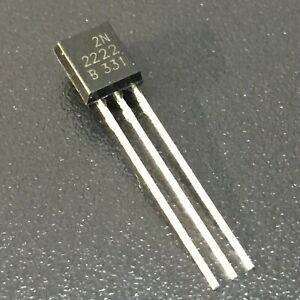

# S4A 12 - Relés

## Finalitat

Presentar els **relés**, aprendre per a què serveixen i com es connecten. Com a pràctica muntarem un circuit d'alimentació ininterrompuda amb un **relé**.

## Material

|                               Imatge                               | Descripció                                                           |
| :----------------------------------------------------------------: | :------------------------------------------------------------------- |
|       | Arduino Uno o compatible amb S4A i amb el firmware per S4A carregat. |
|  | Una protoboard                                                       |
|      | Cables de connexió                                                   |
|         | Dos díodes led                                                       |
|    | Dos resistències de 330 Ohms                                         |
|     | Un transistor 2N2222                                                 |
|       | Un xicotet Relé                                                      |

## Què és un relé

Un **relé** és un interruptor controlat mitjançant un senyal elèctric. Seria alguna cosa semblança als polsadors que hem utilitzat, però substituint el nostre dit per un senyal elèctric.

D'aquesta forma, mitjançant un senyal elèctric de poca intensitat podem controlar un circuit de molta major potència, aïllant la part de control.

Segurament tot això us sone una mica de quan parlem dels **transistors**, però tenen finalitats diferents.

- Hi ha límits en el corrent que pot acceptar un transistor, no obstant això es poden dissenyar **relés** per a aguantar qualsevol càrrega.
- El relé **aïlla** completament el circuit de control del de potència, una cosa molt important per a tensions altes.
- Utilitzarem relés quan tinguem càrregues de molta **potència**.
- Utilitzarem un **transistor** per a càrregues xicotetes i quan la velocitat de commutació siga important.
- Un transistor **commuta** (passa **de tall** a saturació o viceversa) milions de vegades més ràpid que un relé.

## Circuit amb transistor i relé

Encara que hi ha molts tipus de relés, per regla general nostre Arduino no té potència suficient per a activar un relé. Però ja hem vist com utilitzar un transistor per a ajudar-nos amb aquest problema.

- Utilitzarem un transistor per a amplificar el senyal de la Base i així poder commutar el relé.

Quan l'eixida digital 10 està a HIGH, el transistor treballa en **saturació** fent que el corrent en l'emissor excite la bobina del relé i mitjançant un electroimant el contacte canvia de posició (se sent un xicotet "clic" cada vegada que això passa).

Si l'eixida digital 10 passa a LOW, el transistor passa **a cort** i al no tindre corrent en la bobina el commutador torna a la seua posició inicial.

Normalment un **relé** consta de 5 pins. Dos pins d'entrada per on connectem la bobina a l'eixida del transistor i a terra, i tres pins d'eixida.

- La connexió entre els pins 2 i 4 és de tipus **normalment tancat**. És a dir, el circuit està tancat mentre no hi haja corrent en la bobina.
- La connexió entre 2 i 3 és de tipus **normalment obert**. Està obert quan no hi ha corrent en la bobina.

## Circuit d'alimentació ininterrompuda

Quan se'ns va la llum a casa el major problema sol ser que se'ns haja fotut una partida en el PC o consola, o que si dura molt se'ns faça malbé el menjar del congelador.

No obstant això, hi ha llocs en els quals un tall de corrent pot portar conseqüències molt pitjors _(fins i tot pitjor que si just estaves el primer en una partida online)_, com pot ser un hospital.

Per això algunes instal·lacions estan dissenyades de manera que si s'hi ha un tall de corrent, es connecten de manera automàtica a una bateria o un generador auxiliar per a poder continuar funcionant.

Nosaltres utilitzarem nostre Arduino per a fer un sistema d'aqueix tipus.

En aquest cas només posarem el circuit electrònic, ja que les connexions poden ser diferents en cada model de relé i el muntatge en la Protoboard seria diferent.

- _Podem mirar el model en el nostre relé i buscar-lo en internet per a veure la seua descripció._
- _Els pins de control (els de la bobina) solen estar pròxims._
- _Si no trobeu informació, per a saber que pins són_ **_normalment tancat_** i **_normalment obert_** _podem fer proves amb Leds._

Ens imaginarem que la **presa comuna** del **relé** \*(la 2 en el dibuix) està connectada a una bateria externa o un generador en comptes de la presa de 5V, o si voleu podeu connectar-la realment a una bateria o unes piles.

La presa 4 del relé és **la normalment** **tancada**, tancada quan no hi ha corrent en la bobina.

La idea és que quan posem a LOW les eixides digitals 10 i 13, simulant un tall de llum, el LED connectat a l'eixida 13 seguisca encés a través de l'alimentació auxiliar en commutar el relé.

Hem col·locat un altre led de color verd per a marcar quan s'està utilitzant l'alimentació **auxiliar**.

El programa que usarem serà el mateix que el Blinking LED però usant dues eixides, de manera que cada vegada que es posen a LOW, commute el relé i connecte l'alimentació auxiliar.

Quan hi ha tensió en l'eixides digitals 10 i 13, veiem que està encés el LED roig i apagat el verd. El **relé** està commutat a la presa 3, **normalment oberta**, per la qual cosa no s'il·lumina el LED que marca que s'està usant l'alimentació auxiliar.

Si s'anara el corrent, les eixides 10 i 13 passen a LOW i veiem com el LED roig segueix encés i el verd que està connectat a l'eixida **normalment tancada** del relé s'encén, alimentat per la presa de 5V, que en el nostre cas està simulant una bateria o generador auxiliar.

Si voleu podeu connectar un LED també a l'eixida normalment oberta del relé, la 3, i veure com va encenent-se l'un o l'altre LED en funció de la posició del relé.

## Contingut important

- Els **relés** són molt interessants a l'hora de controlar càrregues de molta potència.
- Sabem diferenciar entre contactes **normalment oberts** i **normalment tancats**.
- Com funciona un sistema bàsic d'alimentació **ininterrompuda**.

## Veure també

- [Index](../Index.md)
- [README](../README.md)
