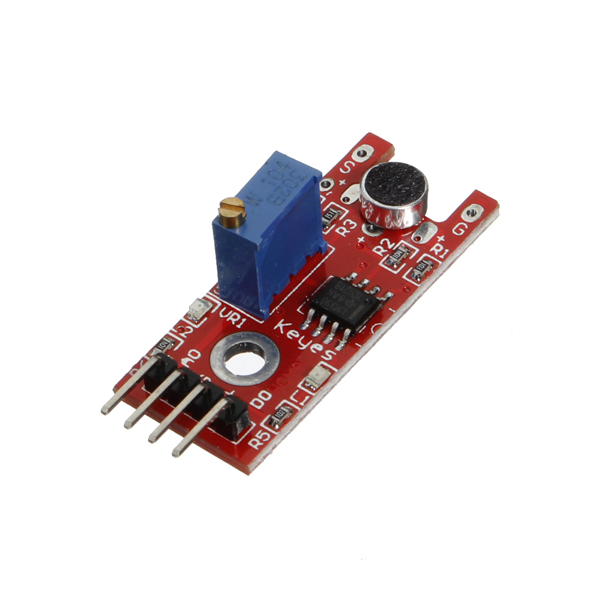
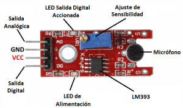
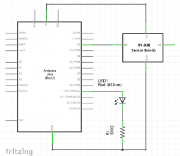
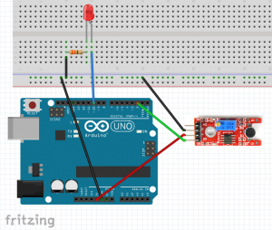
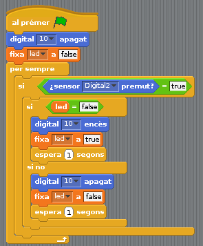

# S4A 14 - Sensor de so

## Finalitat

Presentar el **sensor de so KY-038.** Utilitzar el **pin digital D0** del sensor i muntar un sistema d'il·luminació activat per so.

## Material

|                               Imatge                               | Descripció                                                           |
| :----------------------------------------------------------------: | :------------------------------------------------------------------- |
|       | Arduino Uno o compatible amb S4A i amb el firmware per S4A carregat. |
|  | Una protoboard                                                       |
|      | Cables de connexió                                                   |
|         | Un díode led                                                         |
|    | Una resistència de 330 Ohms                                          |
|      | Un sensor de so KY-038                                               |

## El sensor de so KY-038

Aquest tipus de sensor té muntura **Keyes** per a facilitar-nos el muntatge.

En la part de l'esquerra veiem el pins de connexió:

- En el centre tenim la connexió a 5V i a GND _(+ i G)._
- **D0** és una eixida digital que actua a manera **de comparador**. Si el so captat pel micròfon supera un determinat nivell es posa a HIGH.
- **A0** és una eixida analògica que ens dona un valor entre 0 i 1023 en funció del volum del so.

A més tenim dos Leds, un que ens indica si hi ha alimentació en el sensor i un altre que s'il·lumina si D0 està a HIGH.

L'ajust de sensibilitat del micròfon el fem mitjançant un potenciòmetre que haurem de girar amb un tornavís pla.

## Circuit d'il·luminació activat per so

En aquesta sessió usarem l'eixida **digital** **D0** com a senyal per a encendre un LED, de manera que quan donem una palmada, una xiulada o fem algun soroll una mica alt, s'encenga o s'apague un LED.

Només necessitem connectar el pin D0 i els d'alimentació, tal com es veu en el diagrama electrònic i el muntatge en la protoboard:

Si hem connectat bé el sensor, s'hauria d'il·luminar el LED d'alimentació. El d'eixida digital accionada pot o no estar encés.

## Ajustant el límit de tret

Aquesta és segurament la part més complicada d'aquesta sessió. Per a ajustar el límit de tret el que fem és girar el **potenciòmetre** amb un tornavís. Hem de deixar-ho de tal forma que el LED que marca si està accionada l'eixida digital estiga apagat, però el més pròxim possible al límit en el qual s'encén.

- _Si ho ajustem malament i el LED s'està encés, no detectarem cap canvi i no podrem reaccionar a cap estímul sonor._
- _Si ho ajustem de manera que estiga apagat però massa lluny del límit en el qual s'encén, caldrà cridar a l'increïble Hulk perquè done una palmada per nosaltres._

## Programant el sensor

El programa per a controlar-lo és molt senzill i és el mateix que hem utilitzat diverses vegades per a controlar un interruptor. La diferència és que en comptes d'utilitzar un polsador, si el sensor detecta un so per damunt del límit enviarà un senyal que recollirem en l'entrada digital 2.

- _Si no sou capaços d'encendre el LED d'una palmada, proveu de pegar una xiulada, un bufit o a parlar prop del micròfon._

## Conceptes importats

- Com funciona el sensor de so **KY-038** i a utilitzar la seua eixida digital.
- Podem interaccionar amb el nostre Arduino a través del **so**.

## Veure també

- [Index](../Index.md)
- [README](../README.md)
