# 15 - Fotoresistències o LDR

## Objectius

Els objectius d'aquesta sessió els podem resumir en comprendre la diferència entre el muntatge en sèrie i el paral·lel i conèixer les fotoresistències. Per practicar crearem un sistema d'enllumenat automàtic.

## Material

|                               Imatge                               | Descripció                                                           |
| :----------------------------------------------------------------: | :------------------------------------------------------------------- |
|   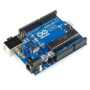    | Arduino Uno o compatible amb S4A i amb el firmware per S4A carregat. |
| 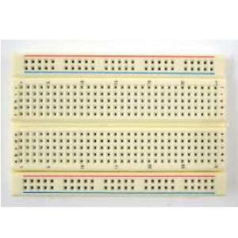 | Una protoboard                                                       |
|   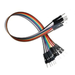   | Cables de connexió                                                   |
|    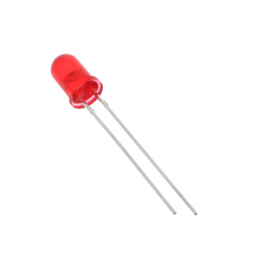     | Un díode led                                                         |
|  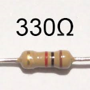  | Dos resistències de 330 Ohms                                         |
|    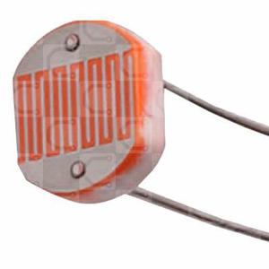    | Una fotoresistència o LDR                                            |

## Les fotoresistències

Les **fotoresistències** o **LDR** _(de l'anglés Light Depending Resistor o resistència dependent de la llum)_ són un tipus de resistències el valor de les quals depén de la **llum** a la qual estiguen rebent. És molt xicoteta quan rep una llum molt intensa _(uns pocs Ωs),_ i augmenta el seu valor a mesura que la llum que rep va descendint.

Normalment se'ls usa de dues maneres, per a un sistema de llums automàtic que s'encenga quan hi ha poca llum ambiente o per a detectar un moviment pròxim si alguna cosa s'interposa entre el focus de llum i la fotoresistència.

Les **fotoresistències** tenen només dues potes, igual que les resistències normals, així que per a mesurar una variació de voltatge _(com hem fet amb els potenciòmetres)_ haurem d'utilitzar un xicotet truc que ens servirà per a moltes altres coses.

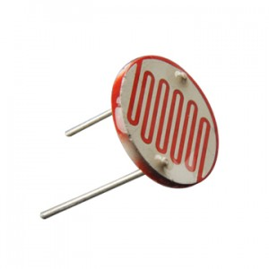

## Connexió de resistències en sèrie

Ja hem parlat abans de la llei d'Ohm, V = I x R, però no hem parlat de les formes en les quals es poden combinar les resistències. Hi ha diverses maneres de connectar les resistències entre si, però a nosaltres la que ens interessa és la connexió en **sèrie**.

La diferència de potencial _(voltatge)_ entre A i B en el cas de Arduino és normalment 5V _(A=5V i B=GND=0V)._

Seguint amb l'analogia de l'aigua, el flux de corrent _(intensitat)_ seria el mateix en tot el recorregut i dependria de la **resistència** total que es trobara en el camí.

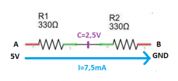

- La **intensitat** que circula per totes dues resistències és la mateixa encara que tinguen valors diferents.
- Si mesurem el **voltatge** en el punt C, dependrà del valor que tinguen les resistències. Si són iguals serà exactament la meitat que en A.

En aquest cas si substituïm les dues resistències per una **resistència equivalent** el seu valor seria:

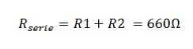

Com sabem que V= 5V, podem trobar la intensitat que circula pel circuit:

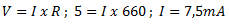

D'aquesta forma podem substituir les dues resistències per aquest circuit:

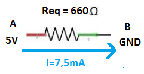

- _La resistència equivalent és la resistència que utilitzaríem per a substituir totes les resistències per una sola._

## Divisor de tensió

Utilitzarem el que hem aprés per a mesurar canvis en el valor de la **fotoresistència**.

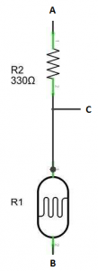

Per a això muntarem un circuit que es coneix com a divisor **de tensió**, muntant **en sèrie** una resistència normal i la fotoresistència.

Si hem arribat fins ací sense perdre'ns, ens adonarem que el voltatge que mesurem en C dependrà del valor de les resistències R1 i R2. I si R1 i R2 són iguals, la tensió en C serà exactament la meitat de la tensió en A.

Com R2 és una resistència de valor fix, el voltatge en C variarà quan canvie el valor de la **fotoresistència**, i d'aqueixa manera podrem mesurar els canvis en la llum que rep.

- Com hem comentat alguna vegada, nostre Arduino treballa amb voltatges de fins a 5V, per la qual cosa no és bona idea connectar-li altres components que treballen amb majors voltatges.
- Podem usar el **_divisor de tensió_** quan vulguem llegir amb el nostre Arduino senyals que siguen majors que 5V. Si les connectàrem directament al nostre Arduino cremaríem el xip.

## Sistema d'enllumenat automàtic

Construirem un circuit que encenga un LED quan la llum baixe d'un cert nivell. Amb un circuit semblant es podria, per exemple, controlar la il·luminació d'un carrer, un parc o un jardí a la nit.

L'esquema electrònic i el muntatge en la Protoborad són bastant senzills:

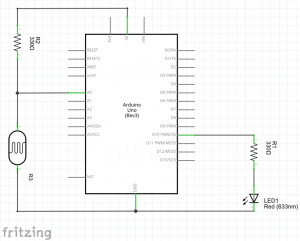
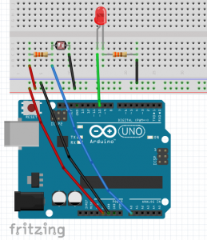

A l'hora de programar, primer fixar-vos en la taula de resum de valors per a saber la lectura que tenim en A0, que dependrà de la llum de l'habitació en la qual estiguem.

En el nostre programa simplement compararem la mesura actual amb aqueix valor, i si és major, és a dir si descendeix la intensitat de la llum que incideix en **la fotoresistència**, (per exemple si tapem el sensor amb la mà) s'active l'eixida digital 10 i s'encenga el LED.

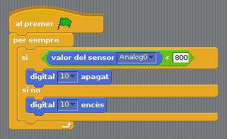

Jo he posat el límit en 800 per a encendre's. Però podeu triar el que millor s'adapte al nivell que vulgueu per a poder provar-lo. Simplement poseu un límit més alt que el que mesure normalment el sensor i tapeu-lo amb la mà perquè s'encenga el LED.

I com quasi sempre, us recomane continuar jugant amb aquest muntatge i fer, per exemple, un programa que quan passe algun objecte per davant, encenga el LED durant el temps que decidiu, com si fora una llum automàtica.

## Conceptes importants

- Coneixem la diferència entre muntatge en **sèrie** i **paral·lel**.
- Hem muntat **un divisor de tensió**.
- Sabem com utilitzar una **fotoresistència** per a mesurar els canvis de llum.
- Hem construït un **sistema d'il·luminació automàtic**.

## Veure també

- [Contingut](../Contingut.md)
- [README](../README.md)
