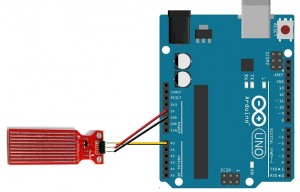

# 16 - Sensor d'aigua

## Finalitat

En aquesta lliçó presentarem els **sensors d'aigua** i aprendrem a
connectar-los i programar-los.

## Material

|                                Imatge                                | Descripció                                                           |
| :------------------------------------------------------------------: | :------------------------------------------------------------------- |
|         | Arduino Uno o compatible amb S4A i amb el firmware per S4A carregat. |
|        | Cables de connexió mascle-femella                                    |
|  | Un **sensor d'aigua.**                                               |

## Els sensors d'aigua

En moltes ocasions voldrem tindre controlat el **volum d'aigua** que tinguem en alguna part. Amb aquesta mena de sensor podem saber si està sec, esguitat, submergit en part o submergit del tot.

Poden ser útils en per a detectar si s'està condensant aigua en algun lloc, per a conéixer el nivell d'aigua en un depòsit _(encara que aquest model té molt poc recorregut)_ o per a saber si està plovent.

Aquests **sensors d'aigua** són senzillíssims de connectar i de programar, i a més barats.

Tenen tres pins de connexió, dues per a 5V i GND, i un altre que connectarem a una entrada analògica del nostre **Arduino.**

## Muntatge i programació

El muntatge és molt fàcil, i l'ordre dels pins del sensor ve marcat en aquest:

- _Poseu-li uns cables més aviat llargs si ho submergireu e algun lloc, per a tindre'l allunyat del Arduino._
- _Cura amb no submergir els pins de connexió ni els cables, o farà un curtcircuit._

La programació també és molt senzilla, simplement encendrem el LED de la pròpia placa Arduino si el nivell d'aigua supera un determinat nivell.

Si submergiu el sensor en un got d'aigua _(amb molta cura),_ podreu veure en la taula resumeixen de valors el valor del sensor, i com s'encén el LED quan sobrepassa el valor que li hem indicat.

Sempre us recomanem continuar provant cosetes, però en aquest cas no em sembla assenyat tindre aigua prop del nostre **Arduino**, ja que l'electrònica i l'aigua no mengen en el mateix plat. Així que no us recomane experimentar coses molt complicades amb aquest sensor.

### Conceptes importants

- Hem presentat els **sensors d'aigua.**
- Sabem connectar-los i programar-los.
- Hem fet un xicotet experiment de mesurador **de nivell d'aigua.**

## Veure també

- [Index](../Index.md)
- [README](../README.md)
