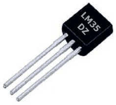
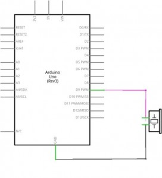
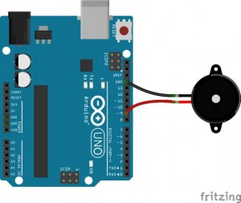
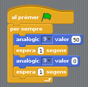
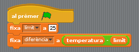
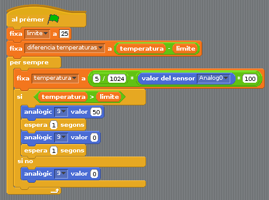
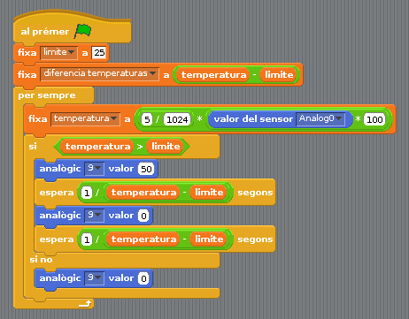

# 17 - Els brunzidors o buzzer

## Finalitat

Aquesta lliçó té per finalitat conèixer el **brunzidors** i aprendre com funcionen. Per fer-ho crearem una **alarma** sonora i ho combinarem amb un **sensor de temperatura.**

## Material

|                               Imatge                               | Descripció                                                           |
| :----------------------------------------------------------------: | :------------------------------------------------------------------- |
|       | Arduino Uno o compatible amb S4A i amb el firmware per S4A carregat. |
|  | Una protoboard                                                       |
|      | Cables de connexió                                                   |
|  | Un brunzidor (brunzidor)                                             |
|      | Un Sensor de temperatura LM35DZ o similar                            |

## Els brunzidors (buzzer)

Els **brunzidors** són uns components electrònics compostos per un cristall _(com pot ser el quars)_ que vibra quan reben un senyal elèctric.

Depenent del valor d'aqueix senyal vibrarà amb una determinada **freqüència**, i si aqueixa freqüència està dins de les que podem sentir, escoltarem com aqueixa vibració produeix un so.

Aquesta habilitat ens pot ser molt útil en els nostres projectes, per exemple per a muntar una **alarma** de forma molt senzilla. Així que ens posarem a això.

## Muntant una alarma

L'esquema electrònic i el muntatge són molt senzills. Només hem de connectar una pota a un pin d'eixida analògic i l'altra a GND. L'única cosa que hem de tindre en compte és que els **brunzidors** tenen **polaritat** (com els díodes LED), i cal assegurar-se de connectar-ho
correctament.

- _Si connectem les potes a l'inrevés simplement no sonarà. Amb donar-li la volta ja està arreglat._
- _Les resistències no tenen **polaritat**, per això podem connectar-les en els dos sentits._

El primer provarem que estiga ben connectat. Utilitzarem un programeta molt simple perquè sone de manera intermitent.

I ara podem combinar un brunzidor i qualsevol dels sensors que hem utilitzat durant aquestes sessions i programar una alarma que ens avise quan el nivell d'aigua supere un determinat nivell, quan puge o baixe massa la temperatura... o qualsevol cosa que se us ocórrega.

Jo utilitzaré el sensor de temperatura, de manera que si la temperatura sobrepassa un determinat límit, el brunzidor comence a sonar de la forma que hem dit.

Si no recordeu com es connecta o com funciona el sensor de temperatura podeu anar **a la lliçó 13** que està dedicada a aquest sensor.

Farem que l'alarma sone de manera intermitent, i més ràpid cada vegada a mesura que se supere més el límit que hàgem posat.

És un bon costum crear variables i assignar-los un valor en comptes de ficar directament a mà aqueix valor en el programa, sobretot si l'usarem diverses vegades. D'aqueixa forma si volem modificar aqueix valor en tot el programa només haurem de canviar la instrucció en la
qual assignem el valor a la variable, en lloc d'haver de canviar-lo cada vegada que s'usa en el programa.

Per això crearem dues variables que es diguen _"límit"_ i _"diferència"._

La programació perquè sone el brunzidor seria molt semblant a la qual utilitzem en la lliçó del sensor de temperatura.

Ara només ens falta modificar-ho perquè sone cada vegada amb intermitències més ràpides a mesura que la temperatura vaja pujant per damunt del límit. Per a això el que fem és que els temps d'espera siguen inversament proporcionals a la diferència de la temperatura i el límit.

- _Inversament proporcional significa que, a mesura que cresca la variable que estem mesurant (diferència de temperatura) el valor de la qual volem controlar (el temps) disminuïsca._

## Conceptes importants

- Què és **un brunzidor** i com funciona.
- Com crear una **alarma**
- Continuem intentant agafar bons costums.

## Veure també

- [Index](../Index.md)
- [README](../README.md)
