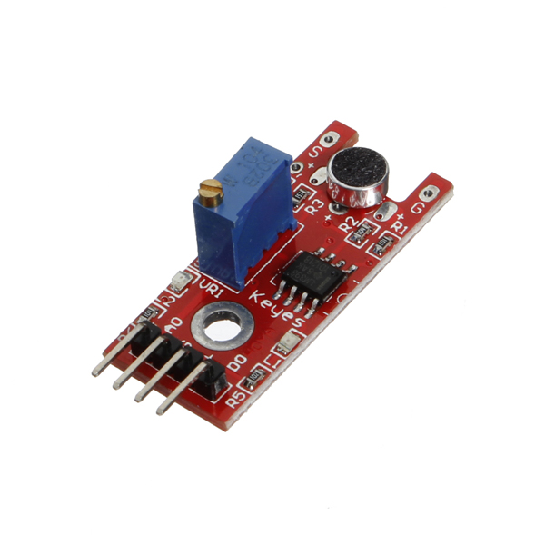

# 18 - Els blocs llapis en s4a

## Finalitat

En aquesta lliçó presentarem la categoria de blocs **«Llapis»**. Utilitzarem l'entrada analògica A0 del sensor so **KY-038** i dibuixarem el volum d'un so en l'escenari.

## Material

|                               Imatge                               | Descripció                                                           |
| :----------------------------------------------------------------: | :------------------------------------------------------------------- |
|       | Arduino Uno o compatible amb S4A i amb el firmware per S4A carregat. |
|  | Una protoboard                                                       |
|      | Cables de connexió                                                   |
|      | Un sensor de so KY-038 o similar                                     |

## Els blocs llapis

Aquesta categoria de blocs s'utilitza quan volem pintar alguna cosa en l'escenari a partir el moviment d'un objecte. Podem utilitzar-ho, per exemple, per a marcar el recorregut que ha
seguit un objecte, o per a fer **gràfics** i diagrames a partir dels valors que ens envie un sensor.

Per a aclarir una mica com funciona, farem un exercici molt senzill en el qual col·locarem un objecte en el centre de l'escenari diverses vegades i el mourem de manera aleatòria, de manera que vaja deixant un rastre i faça una marca en el punt en el qual acabe cada moviment.

El primer que farem serà crear una **disfressa** per a l'objecte i esborrar el que ve per defecte. Jo he importat una pilota de futbol.

Res més començar esborrem el que haja dibuixat prèviament en l'escenari utilitzant el bloc _de "Llapis" "neteja"_ i fixem el gruix del traç amb el bloc _"fixar grandària del llapis a ..."._

Utilitzem el bloc _"repeteix ..."_ perquè volem que l'objecte faça un nombre determinat de moviments abans de parar el programa. Posicionem l'objecte en el centre de l'escenari, utilitzem el bloc _"baixar llapis"_ perquè comence a dibuixar i fixem el color del llapis a un número aleatori entre 0 i 200 amb el bloc _"fixar color del llapis a ..."._

- _El bloc "baixar llapis" és l'equivalent a pressionar un llapis en un paper. Fins que no ho alcem, tot moviment de l'objecte deixarà un rastre en l'escenari de la forma en què l'indiquem._
- _Fixem el color a un número aleatori perquè cada repetició línia pinte la línia d'un color diferent._
- _Els colors del **llapis** en **S4A** van des de 0 a 200, per això hem agafat aqueixos límits per al número aleatori._

A continuació fem que l'objecte es moga a una posició nova utilitzant el bloc _de "Moviment" "lliscar en ... segons a x: ... y: ...",_ alcem el **llapis** amb el bloc _"pujar llapis"_ i utilitzem el bloc _"estampa"_ perquè deixe una marca amb la forma de l'objecte.

- _Recordeu que les mitjanes de l'escenari són 480×360, sent el centre (0,0), d'ací els límits dels valors aleatoris._
- _Pugem el llapis perquè en tornar a posar l'objecte en el centre de l'escenari no pinte res més._
- _El bloc "estampa" deixa una impressió de l'objecte en el punt de l'escenari en el qual es trobe._

En acabar d'executar-se el programa tindrem alguna cosa semblant a això en l'escenari.

## Dibuixant el volum d'un so

Utilitzarem el que hem aprés en aquesta lliçó i en **la lliçó 14** per a dibuixar un gràfic amb el volum d'un so. Mesurarem el senyal que envia el sensor **KY-038** pel pin **A0** i la dibuixarem en l'escenari.

- _El pin A0 ens retornarà un valor entre 0 i 1023 en funció del volum del so._

L'esquema electrònic i el muntatge en la Protoboard són molt senzills.

Començarem dibuixant un objecte per a dibuixar a partir d'ell. Com no volem que es note, podem, per exemple, fer un punt el més xicotet possible i del color del qual dibuixarem el gràfic.

Fixem les **condicions inicials:**

- Esborrem l'escenari amb el bloc "esborrar".
- Fixem el color del llapis al qual vulguem. Abans hem utilitzat un número, però hi ha un altre bloc on podem seleccionar el color a partir d'una paleta.
- Alcem el llapis per si està l'objecte en una altra posició de l'execució anterior.
- Posicionem l'objecte en la part esquerra de l'escenari i en el centre de l'eix I.
- Baixem el llapis perquè comence a dibuixar.

Ara ja podem col·locar el bloc *"per sempre" *perquè repetisca les altres accions en bucle. Comencem sumant-li 1 a la posició en x perquè en cada execució pinte el volum una mica més a la dreta en l'escenari, de manera que no es vagen solapant.

Si en aquest moment executem el programa veurem com es pinta una línia d'esquerra a dreta.

Per a saber a quin nivell de sensibilitat tenim ajustat el sensor, podem guardar en una **variable** el valor recollit en l'entrada analògica A0 i visualitzar-ho en l'escenari com hem aprés.

- _A major sensibilitat major serà el canvi en el senyal que envia el sensor per A0 en funció del so._
- _Jo ho he ajustat en el mateix punt que en la lliçó anterior, en el punt en el qual just s'apaga el LED que ens mostra si està activat el pin D0._

Per a dibuixar el volum en cada iteració, hem de fixar la posició en y de l'objecte a la posició anterior _(que fixem a 0 en cada repetició perquè pinte sempre a respecte al punt mitjà de l'eix Y)_ sumant-li el valor d'A0 que hem guardat en la variable _"volum"._ A aqueix valor li hem de restar un valor pròxim al qual hem ajustat la sensibilitat, perquè no ens pinte una ratlla molt gruixuda quan no hi ha so.

Només ens queda fer que cada vegada que arribe al final de l'escenari, torne a començar a dibuixar des de l'esquerra. Per a això llevem el **llapis** fins a la posició inicial i esborrem l'escenari perquè comence a dibuixar de nou amb l'escenari en blanc.

- _Recordeu que cal pujar el llapis per a portar-lo a la posició d'inici sense que pinte i tornar a baixar-ho perquè comence a pintar de nou._

Si ara executem el programa veurem com en parlar, xiular, bufar o fer qualsevol so en el micròfon, en l'escenari es pinta la variació en el volum.

Jo li he acostat un altaveu xicotet amb una cançó i el resultat ha sigut aquest:

Si voleu practicar una mica més podeu agafar la **lliçó 16** del sensor de temperatura i, per exemple, registrar la temperatura cada cert temps utilitzant el que hem aprés i variant una miqueta el programa.

## Conceptes importants

- Podem utilitzar els blocs **"Llapis"** per a fer dibuixos en l'escenari a partir del moviment d'un objecte.
- Sabem com funciona l'eixida **analògica** del sensor de so **KY-038.**
- Hem fet **un gràfic** a partir dels valors recollits per una entrada analògica, podríem fer el mateix amb entrades o eixides analògiques o digitals.

## Veure també

- [Index](../Index.md)
- [README](../README.md)
