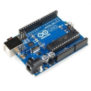
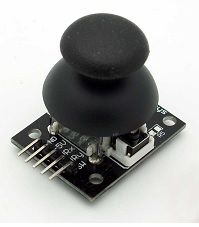

# 19 - Els joysticks

## Objectius

Conèixer el joystick, aprendre a connectar-ho correctament i utilitzar el joystick per a moure objectes en l'escenari.

## Material

|                                 Imatge                                 | Descripció                                                           |
| :--------------------------------------------------------------------: | :------------------------------------------------------------------- |
|           | Arduino Uno o compatible amb S4A i amb el firmware per S4A carregat. |
|      | Una protoboard                                                       |
|          | Cables de connexió                                                   |
|  | Un Joystick                                                          |
|        | Una resistència de 330 Ohms                                          |

## Què és un joystick i com connectar-lo

Un **joystick** està compost per un parell de potenciòmetres (un per a l'eix X i un altre per a l'Y) que transforma el moviment en X e Y en un senyal elèctric proporcional a la seua posició, i que si deixem de fer força en ell torna a suposició central. A més solen incloure un botó en pressionar-los.

Té 5 pins: X, Y, 5V, GND i el botó _(que se sol cridar SW, que ve de switch)._

El muntatge és molt senzill tenint en compte que ja hem muntat cada part del joystick per separat en altres sessions, però heu de tindre una mica de cura en connectar l'eixida SW del botó.

Si connecteu l'eixida SW directament a una entrada digital de Arduino per a llegir el seu estat no us funcionarà correctament.

En realitat el pin SW i el de GND es comporten en connectar-los com si fores els pins d'un polsador, com el que vam veure en **la sessió 6**. Per tant, haurem de connectar-li una resistència en **PULL UP o PULL DOWN,** o veurem com el valor que llegim no deixarà de fluctuar.

El diagrama elèctric amb la resistència en **PULL UP** i el muntatge en la protoboard serian el següents:

## Joystick digital

Primer programarem el **joystick** de manera que no importe quant moguem la palanca en una direcció, és a dir, mourem els objectes en la direcció que vulguem però a una velocitat sempre fixa.

També farem que en prémer el joystick deixem un segell en l'escenari amb la forma de la disfressa de l'objecte. Podeu utilitzar la disfressa que vulgueu. Jo he importat un dibuix d'un ratpenat.

Començarem esborrant l'escenari i fixant la posició de l'objecte com ja sabem d'altres sessions.

Ara programarem el moviment en l'eix X. Ens fixarem en la taula de valors dels sensors per a veure el valor que llig l'entrada analògica A1 _(a la qual hem connectat l'eix X del joystick)_ quan el joystick està en el centre. En el meu cas llig 500.

Si movem el **joystick** a l'esquerra, el valor que llegirà A1 serà menor que el valor en repòs, i major si ho movem cap a la dreta. Per tant, el que farem és que si el valor que llegim està per davall del valor en repòs es moga l'objecte cap a l'esquerra de l'escenari; i si està per damunt el moga cap a la dreta.

- _Li hem donat una mica de marge al límit perquè no detecte canvis massa xicotets._
- _Podeu triar la velocitat que vulgueu per a moure's canviant-la en el bloc "sumar ... a x"._

Farem el mateix amb l'eix Y, però tenint en compte que en moure el joystick cap avall augmenta el valor que llegim en A2, i descendeix en moure'l cap amunt.

Ens queda d'incloure en el programa que si premem el joystick, connectat a l'entrada digital D2, faça un segell amb la imatge de la disfressa que té l'objecte. Li afegirem un bloc d'espera perquè no detecte diverses pulsacions com ja sabem.

_Com hem connectat la resistència al polsador en PULL UP, l'entrada D2 llegirà true quan no estiga pressionat i false quan pressionem el polsador._

Si proveu una mica tindreu alguna cosa com això:

## Joystick analògic

Una de les característiques del joystick és que podem controlar la intensitat amb què el movem cap a qualsevol de les direccions. Per a aconseguir aprofitar-nos d'això haurem de modificar una mica la programació.

Començarem ajustant la **velocitat** del moviment en **l'eix X**. Perquè la velocitat a la qual es moga vaja de 0 a 10, tant a la dreta com a l'esquerra, farem el següent:

- Restem a la lectura actual el valor de la lectura amb **el joystick** en repòs; en el meu cas 500. D'aqueixa forma la velocitat serà 0 quan estiga en repòs.
- Perquè la velocitat màxima siga més o menys 10, dividirem el resultat de l'operació anterior entre 50. D'aquesta forma quan en l'eix X el valor siga màxim, és a dir, 1023-500=523; la velocitat serà 523/50= 10,46.
- Quan el valor siga mínim, 0-500=-500. En dividir-ho entre 50, -500/50=-10.
- _Si voleu que la velocitat màxima siga major només heu de canviar 50 per un número més xicotet, i més gran perquè siga menor._

Fem el mateix amb **l'eix** Y, tenint en compte que en repòs tenim el valor 513, i que volem invertir el moviment com en l'apartat anterior. Li podeu afegir també la capacitat de fer un segell de l'objecte.

## Conceptes importants

- Sabem com **connectar** correctament un **joystick**.
- Com detectar la **direcció** en la qual es mou.
- Fer que la **velocitat de moviment** d'un objecte siga proporcional al desplaçament del **joystick**.
- Com utilitzar el **polsador** que inclou el **joystick**.

## Veure també

- [Index](../Index.md)
- [README](../README.md)
