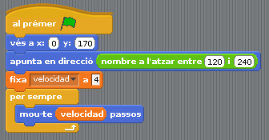
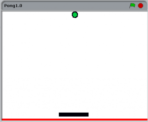

# 20 - Primer videojoc: Pong (1 jugador)

## Finalitat

Anem a fer que un objecte es moga de manera autònoma per l'escenari. Per aconseguir-ho utilitzarem la categoria de blocs **«Sensors»** i crearem diversos programes per a un objecte.

## Material

|                                Imatge                                 | Descripció                                                           |
| :-------------------------------------------------------------------: | :------------------------------------------------------------------- |
|          | Arduino Uno o compatible amb S4A i amb el firmware per S4A carregat. |
|     | Una protoboard                                                       |
|         | Cables de connexió                                                   |
|  | Un potenciòmetre                                                     |

## Una mica d'història

Fa molt de temps (1972-1976), els xiquets i els no tan xiquets es divertien amb la primera generació de consoles.

Eren aparells molt senzills d'usar, bastava amb connectar-los a la tele i posar-se a jugar. Els controls eren simplement rodes o clavilles distribuïdes normalment per la caixa de la pròpia consola.

Tenien un o diversos jocs gravats en la memòria i no podies comprar més jocs, perquè no tenien cap suport per a això. Però va haver-hi un joc que va sobreeixir per damunt de tots, el **Pong**, una espècie de tennis molt simplificat. No hi havia un sistema d'aquella primera generació que no incloguera un joc tipus Pong.

Quan en el nadal de 1975 Atari va comercialitzar la seua pròpia versió del Pong, es va convertir en un èxit immediat. Consistia bàsicament en una carcassa amb connexió a la televisió i dues rodes com a controls. Més tard van eixir versions que incloïen fins a 16 variacions d'aquest
joc _(que eren pràcticament el mateix)_ i infinitat de consoles clòniques.

El que farem en aquesta lliçó és utilitzar el que hem aprés per a fer la nostra pròpia versió de Pong amb Arduino per a un jugador i de pas aprendre unes quantes coses pel camí. En la següent lliçó ho farem per a dos jugadors.

Tenint en compte que en el seu moment costava uns 100€ _(que ara equivaldrien a quasi 400 €, el mateix que una consola d'última generació)_, supose que si li hagueres dit a algú en aquella època que un xiquet podria fabricar el seu propi Pong a casa com farem nosaltres, t'haguera mirat com a un marcià.

## Versió de pong per a un jugador

La idea és simular una espècie de frontó, on controlarem una barra per a fer rebotar una pilota i impedir que se'ns escape. Com manejarem la barra amb un **potenciòmetre**, el muntatge serà el mateix que en **la lliçó 11**.

Dibuixem una barra, l'ajustem a la grandària que vulguem i la programem perquè es posicione i es moga de la mateixa manera que en **la lliçó 11**.

- _Recordeu canviar el nom de l'objecte i de la disfressa a Barra, o una cosa semblant, per a continuar mantenint l'ordre i la claredat en els nostres projectes._
- _Amb el mateix propòsit us recomane esborrar la disfressa on està dibuixada la placa Arduino._

Per a fer la pilota crearem un nou objecte, com ja sabem d'altres sessions, i li farem una disfressa. Per a programar el moviment de la pilota utilitzarem alguns blocs nous i una nova manera d'enfocar els nostres programes.

## Divideix i guanyaràs

Fins ara, sempre que hem programat un objecte ho hem fet tot en una única seqüència d'instruccions. No obstant això, a mesura que els programes es compliquen pot ser-nos útil dividir-ho en diversos programes, de manera que cadascun d'ells ens solucione una part
concreta del problema.

- _Encara que no és exactament el que s'entén en la programació tradicional com a funció, durant aquest tutorial de S4A ens referirem a cadascun d'aquests xicotets programes com a funció._
- _Si us resulta més senzill organitzar el programa en funcions diferents a les que plantegem ací, no dubteu a fer-ho com ho vegeu més clar._
- _Dividir un problema gran en uns altres més xicotets i tractar de solucionar-los a poc a poc, és una pràctica molt recomanable en qualsevol aspecte de les nostres vides._

El primer que farem és posicionar la pilota d'en la part superior de l'escenari i en el centre de l'eix X. Utilitzarem el bloc _"anar a x: ..._ _y: ... "._

En aquest mateix programa (funció) anem també a donar-li a la pilota la **direcció** inicial i la **velocitat** a la qual es mourà.

Per a donar-li la direcció inicial utilitzarem el bloc _de "Moviments" "apunta en direcció"._ Si despleguem les opcions d'aqueix bloc veurem al fet que direcció corresponen els valors.

- També podem indicar la direcció amb valors entre 180 i 360 en comptes d'utilitzar valors negatius.
- Com volem que vaja cap avall en una direcció aleatòria que no siga molt pròxima a l'horitzontal, li donarem un valor a l'atzar entre 120 i 240.

La velocitat li la donarem amb el bloc _de "Moviment" "moure ... passos"_ i la creació d'una variable anomenada _«velocitat»._ Jo li posaré perquè comence amb 4. Haurem de ficar-la en
un bloc _"per sempre"_ o només es mouria 4 passos una vegada i es pararia.

En aquesta mateixa funció farem que la pilota rebote en tocar les vores de l'escenari utilitzant el bloc _de "Moviment"_ _"rebotar si està tocant una vora"._

En una nova funció farem que la pilota rebote si toca la barra. Els blocs que s'utilitzen perquè interactuen els objectes en l'escenari estan en **la categoria** _"Sensors"._

Començarem la **funció** amb el bloc de control de la bandera verda i el bloc _"per sempre si ..._".

Com a condició li posarem el bloc _de "Sensors" "tocant ...?",_ i en el menú desplegable seleccionarem Barra, o el nom que hàgem posat a fi de la barra.

Farem que si pilota toca la barra rebote com si fora una paret, però li afegirem una mica d'aleatorietat per a evitar quedar-nos atrapats en situacions sense fi i afegir-li una mica de dificultat al joc.

Per a calcular el rebot utilitzarem el bloc _"direcció"_, que és una **variable** que guarda el valor de la direcció de moviment de l'objecte, en aquest cas la pilota.

Perquè actue com una paret, la direcció en rebotar ha de ser 180º (vertical cap avall) menys la direcció que portava abans.

Li afegirem una mica d'aleatorietat sumant-li un número a l'atzar entre -30 i 30.

Una vegada haja canviat de direcció, farem que es moga 4 passos una única vegada, per a evitar que detecte diversos tocs amb la barra en comptes d'un només.

Ja tenim programat el funcionament dels objectes, però per a convertir-lo en **un videojoc** cal donar-li una mica d'emoció i sobretot fer que puguem perdre.

La manera més senzilla de detectar quan la pilota ens ha sobrepassat és pintar en el fons de l'escenari una ralla de qualsevol color que no siga el de les barres ni la pilota, i fer que si la pilota toca aqueix color s'acabe el joc.

Crearem una nova **funció** per a detectar si la pilota toca la línia, i si la toca, detindre tots els programes.

Utilitzarem una estructura semblant a la qual detecta si toca la barra, però usant el bloc _de "Sensors" "tocant el color ...?"._

Si fem clic en el quadrat amb el color ens eixirà una icona de comptagotes. Seleccionem el color que volem en **l'escenari**, en aquest cas el roig de la línia que hem pintat i el color del quadre del bloc canviarà.

Dins de la condició col·loquem el bloc _de "Control" "detindre tot"_.

## Afegint una mica de dificultat

Complicarem una mica més tant el programa com el videojoc en si, fent que la velocitat de la pilota vaja pujant a mesura que passa el temps i que quan perdem se'ns mostre el temps que hem aconseguit aguantar.

En comptes de donar-li una velocitat fixa a la pilota, li assignarem el valor d'una variable _"velocitat"_ a la qual fixarem a l'inici un valor de _4 (o el que vulguem)_. Això ho inclourem en **la funció** en la qual fixàvem les condicions inicials.

Ara li afegirem una altra funció que faça que puge la velocitat dos passos cada deu segons. Utilitzarem el bloc _de "Sensors" "cronòmetre",_ que és una variable que guarda el temps que ha passat des de vam obrir o creem un projecte.

- Amb el bloc _"reiniciar cronòmetre"_ el posarem a 0 cada vegada que iniciem el programa.
- Creem una variable _"límit"_ a la qual li assignarem el valor 10.
- També podríem incloure aquests blocs en la funció en la qual fixem les condicions inicials.

Farem que si el valor del _"cronòmetre"_ és major que _"límit"_ li sume dos a la variable _"velocitat"_ i li sume 10 al valor del límit perquè torne a pujar la velocitat deu segons després.

Ja només ens queda programar que quan perdem se'ns mostre en pantalla quant temps hem aguantat.

En la funció en la qual detenim els programes, farem que abans pare la pilota i ens mostre el valor del cronòmetre. Utilitzarem el bloc _de "Aparença" "digues ... durant ... segons"_, li assignem el valor del cronòmetre i fem que el mostre durant 5 segons.

D'aquesta forma la programació de l'objecte Bola ens quedaria així.

- _Podeu organitzar els programes com millor us semble, no té per què ser d'aquesta mateixa manera. Si us resulta més senzill, podeu construir-ho en un únic programa d'aquesta forma._

- _Quan aneu a jugar, recordeu que podeu posar-ho a pantalla completa, llevar la taula de resum de valors perquè no us moleste i mostrar les variables que vulgueu, com per exemple la velocitat de la bola i el cronòmetre, per a veure què tal va la partida._

## Conceptes importants

- És més fàcil dividir els programes en diverses **funcions**.
- A crear objectes que es mouen de manera autònoma per l'escenari .
- Sabem fer que interactuen gràficament uns objectes amb uns altres.
- Coneixem el nou tipus de blocs _"Sensors"._

## Veure també

- [Index](../Index.md)
- [README](../README.md)
