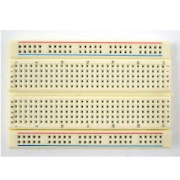
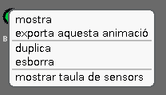
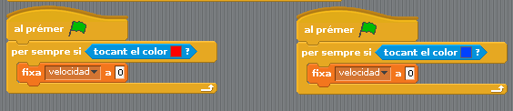

# 21 - Pong per a dos jugadors

## Finalitat

Entendre com manejar dues **entrades analògiques** simultàneament. Aprendre a crear **objectes arduino** i a exportar i importar objectes complets. A més introduirem els **sons** en S4A.

Versió de Pong per a dos jugadors amb marcador i sons

## Material

|                                Imatge                                 | Descripció                                                           |
| :-------------------------------------------------------------------: | :------------------------------------------------------------------- |
|          | Arduino Uno o compatible amb S4A i amb el firmware per S4A carregat. |
|     | Una protoboard                                                       |
|         | Cables de connexió                                                   |
|  | Dos potenciòmetre                                                    |

## Plantejament

Com ja comentem, Atari Pong va suposar una revolució en la història dels videojocs. Dues funcions noves que incloïa van ser:

- Tenia **so**.
- Portava el compte de la partida. En altres plataformes calia apuntar els punts en un paper.

En aquesta lliçó farem **un Pong** per a dos jugadors, i a incloure aquestes dues funcionalitats. Si esteu utilitzant aquestes lliçons en una classe de tecnologia d'algun col·legi, podeu posar-vos per parelles per a fer-la, i de pas veure qui gana tirant una partida.

El muntatge serà el mateix que en la **lliçó 20**, però afegint un segon potenciòmetre. Si no teniu dos potenciòmetres explicarem la manera de manejar una de les barres amb el ratolí de l'ordinador.

Reutilitzarem part del programa de la lliçó anterior, però canviant i afegint algunes coses. Començarem modificant la barra que ja tenim i creant una segona barra.

Per a aprofitar que l'escenari és més gran en l'eix X, farem el camp en sentit horitzontal, per la qual cosa modificarem el dibuix i el programa de la barra de la lliçó anterior per a fer que estiga en vertical i es moga en l'eix Y.

## Nou objecte arduino

Fins ara hem creat objectes sempre de la mateixa manera. Però si volem crear un objecte que tinga accés a les entrades i eixides digitals i analògiques com la barrra, necessitarem crear un **objecte Arduino**.

- _Els objectes Arduino proporcionen blocs per a les funcionalitats bàsiques del microcontrolador, escriptures i lectures digitals i analògiques, i altres funcionalitats d'alt nivell._
- _També trobarem blocs per a tractar amb motors estàndard i servomotors de rotació contínua (els utilitzarem en les seues respectives lliçons més endavant)._

Per a crear, dibuixar o importar **un objecte Arduino** farem clic en els botons que hi ha en la part superior dreta del llistat d'objectes.

Si triem crear-ho ens eixirà un quadre de diàleg com aquest:

- Si volguérem utilitzar una segona placa Arduino per a controlar l'objecte, seleccionaríem _"Nova connexió"._
- Com usarem la mateixa placa, seleccionem _"Utilitzar la connexió de l'objecte Barra"._

Com en aquest cas volem fer un objecte igual que la barra, podríem simplement donar-li amb el botó dret del ratolí a fi de la barra i donar-li a duplicar.

Una vegada creada canviarem de nom els objectes com Barra1 i Barra2, per allò de la neteja i l'ordre.

Haurem de modificar el programa de la segona barra per a posicionar-la en el costat oposat de l'escenari. També dibuixarem dues línies de colors diferents darrere de les barres igual que en la lliçó anterior.

Si no tenim dos potenciòmetres, podem controlar una de les barres amb el ratolí, amb el bloc _de "Sensors"_ i _"ratolí y"_.

## Exportar i importar objectes

En S4A existeix la possibilitat d'exportar **objectes** per a guardar-los i utilitzar-los en altres projectes. Suposem que hem començat un projecte nou per a aquesta lliçó i volem reutilitzar la pilota de la **lliçó 20** per a modificar-la i així estalviar-nos treball.

Si obrim el programa del Pong per a un jugador i en el llistat d'objectes fem clic amb el botó dret en la pilota, o en qualsevol altre objecte, veurem que ens dona l'opció d'exportar objecte.

Ens eixirà un quadre de diàleg i podrem triar on guardar-lo.

Si ara des d'un altre projecte, en aquest cas el Pong per a dos jugadors, donem **a "Triar un nou objecte des d'arxiu"** o a **"Triar un nou objecte Arduino des d'un fitxer"** en funció de la mena d'objecte que siga, i busquem l'objecte que hem exportat, tindrem en el nou projecte l'objecte amb totes les disfresses i programes inclosos.

## Modificant la programació de la pilota

El primer que farem serà modificar la posició inicial de la pilota i la direcció inicial del moviment.

- Fixem la posició al centre de l'escenari, x=0, y =0.
- Fem que la pilota comence apuntant a una de les barres, utilitzant el bloc _"apuntar cap a ..."._

Ara hem de canviar la funció en la qual fem que rebot la pilota en tocar la barra, perquè rebote si toca qualsevol de les dues. Utilitzarem el bloc _de "Operadors" "... o ..."._

També canviarem la forma en què canvia de direcció en rebotar, ja que ara les barres estan en vertical.

Farem una **funció** igual que la que detectava si la pilota tocava el color roig, però tocant el color que està darrere de l'altra barra, en aquest cas blau, i els llevarem a ambdues els blocs que mostraven el temps i detenien els programes.

La **funció** en la qual pugem la velocitat de la bola cada 10 segons, la deixarem igual per a donar-li una mica d'emoció al joc.

Amb això ja tenim la part principal del videojoc, però ara introduirem les millores de les quals parlàvem.

## Comptant els punts: marcador

Per a poder portar la puntuació, necessitem crear dues variables, _"puntosrojo"_ i _"puntosazul"_ que inicialitzarem a 0.

Fem que si toca la línia blava sume un punt a "puntosrojo" i si toca la roja a "puntosazul", així anirem comptant els punts.

També hem de fer que una vegada sumat el punt, la pilota torne al centre i comence a moure's cap a la meitat de camp del qual ha perdut el punt, en direcció a la barra.

- Fixem la posició de la bola al centre de la pantalla.
- Fixem la velocitat a 0 durant 2 segons per a donar temps a preparar-nos.
- Utilitzarem el bloc _"apuntar cap a",_ seleccionant la barra que correspon en cada cas.
- Tornem a fixar la velocitat a 4.
- Reiniciem el cronòmetre, perquè torne a començar a pujar la velocitat cada 10 segons.

Ja només ens queda fer que si un dels jugadors arriba a 3 punts, acabe la partida i mostre qui és el guanyador.

- Utilitzarem el bloc _de "Control" "si ..."_, i l'operador "... = ..." per a comparar les variables _"puntosrojo"_ i _"puntosazul"_ amb 3 _(o els punts que vulgueu que calga aconseguir per a guanyar)_.
- La comparació cal fer-la després que hàgem sumat el punt al marcador.
- Mostrarem un missatge en pantalla amb el guanyador utilitzant el bloc _de "Aparença" "dir per segons"_ durant 5 segons.
- Utilitzarem el bloc _de "Control" "detindre tot"_ per a parar els programes de tots els objectes si un jugador guanya la partida.

## Com afegir sons als nostres programes

En S4A els sons es creen i s'afigen al programa de forma molt similar a les disfresses. Seleccionem l'objecte al qual volem afegir-li so, en aquest cas la bola, i donem a la pestanya _"Sons"._ Funcionen de manera semblant a les disfresses.

Podem gravar-los o utilitzar sons que tinguem guardats. Jo utilitzaré tres sons dels quals venen per defecte en instal·lar S4A, un per al rebot amb la barra, un altre per a quan es faça un punt i un altre quan algú guanye la partida.

Els blocs relacionats amb els sons estan en la categoria _"So"._

Anem al programa de la pilota i utilitzem el bloc _"tocar so ..."_, seleccionant en el menú desplegable el so que vulguem.

- Usem el so _"Pop"_ quan rebot amb qualsevol de les barres.
- _"WaterDrop"_ cada vegada que hi haja un punt.
- _"Bell Toll"_ quan algú guanye la partida.

Ara sí hem acabat la nostra pròpia versió de Atari Pong.

- _Recordeu que podeu posar-ho a pantalla completa i mostrar en l'escenari els punts que porta cadascun marcant en el llistat de blocs les variables on els guardem._
- _Si fem clic amb el botó dret en una variable en l'escenari podem triar el format per a mostrar-les._

## Conceptes importants

- Existeixen diferents **tipus d'objectes** en **S4A**, i sabem com crear-los en funció del que necessitem.
- Podem reutilitzar objectes en altres projectes.
- Sabem com crear **sons** i utilitzar-los en el nostre programa.

## Veure també

- [Contingut](../Contingut.md)
- [README](../README.md)
