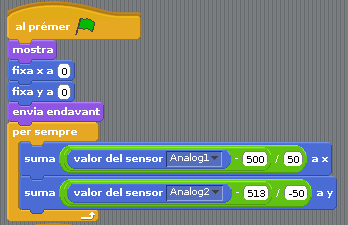

# 22 - VIDEOJOCS S4A: CAÇADIMONIS

## Finalitat

En aquesta lliçó anem a utilitzar el el **joystick** per a fer **un videojoc**. Aprofundirem en les interaccions entre **objectes** i a conéixer alguns blocs **de "Aparença"** nous.

## Material

|                                 Imatge                                 | Descripció                                                           |
| :--------------------------------------------------------------------: | :------------------------------------------------------------------- |
|           | Arduino Uno o compatible amb S4A i amb el firmware per S4A carregat. |
|      | Una protoboard                                                       |
|          | Cables de connexió                                                   |
|  | Un Joystick                                                          |
|        | Una resistència de 330 Ohms                                          |

## Creant els objectes, les disfresses i els sons

Utilitzarem el muntatge de la **lliçó 19** per a fer un videojoc en el qual usarem el **joystick** per a apuntar i disparar els dimonis que apareguen en l'escenari. Comptarem quants dimonis anem caçant i els mostrarem en acabar la partida. I és que encara que us semble mentida,
fa no gaire temps, hi havia molts videojocs que no eren molt més que això.

Començarem creant els objectes que necessitarem i incorporant les seues disfresses i sons.

El primer que farem és dibuixar una disfressa per a l'objecte principal que contindrà la programació per al moviment del joystick. Com serà la nostra mira, li farem una disfressa concorde.

També importarem un so perquè sone cada vegada que disparem. Jo he importat un anomenat _"Laser1"_ dels quals venen per defecte.

- _Recordeu que si heu fet molt gran o molt xicotet la disfressa, podeu ajustar-li la grandària amb els botons de damunt de l'escenari._

Crearem un nou objecte Dimoni, i li farem dues disfresses. Un per al dimoni _(jo l'he importat dels que venen per defecte en S4A_) i dibuixarem o importarem una disfressa que simula una explosió per a quan els disparem.

Li posarem també un so que usarem cada vegada que aparega un.

Ara crearem dos fons per a l'escenari. Un serà l'escenari que usarem normalment. Jo he triat un desert.

L'altre fons serà el mateix però escriurem en ell _"Dimonis Caçats",_ per a utilitzar-lo per a posar el resultat amb el nombre de dimonis que hàgem caçat quan acabe el joc.

## Programació de la mira

Començarem programant l'objecte _"Mira"._ Incorporem la part de la programació del moviment del joystick, a la qual llevarem la part final en la qual segellàvem la disfressa de l'objecte. A més utilitzarem el bloc _de "Aparença" "enviar al capdavant"_ en les condicions inicials.

Aquest bloc el que fa és que aquest objecte sempre es veja per damunt dels altres si estan en la mateixa posició. Ho utilitzarem perquè la mira sempre es veja quan estiguem apuntant als dimonis als quals donarem caça.

Creem una funció nova en la qual farem que si la mira està tocant un dimoni i premem el joystick, envie un senyal als altres objectes. Utilitzarem un bloc de tipus _"Sensors" "tocant ...?"_, en el qual seleccionarem l'objecte _"Dimoni"._

- Incorporem el bloc perquè sone el làser cada vegada que disparem, tant com si donem amb el tret en un dimoni com si no.
- Afegim un comptador que sume un amb cada dimoni al qual aconseguim, de la mateixa forma que hem fet ja altres vegades.
- Li posem un bloc d'espera, perquè no detecte diverses pulsacions seguides del joystick.

També necessitem una funció per a comptar el temps que va passant i poder posar un límit de temps al joc. Ja coneixem l'estructura i els blocs d'altres sessions.

- Incloem el bloc _"enviar a tots Final"_ per a avisar als altres objectes que ha acabat el joc.
- Abans de detindre els programes esperem 5 segons perquè ens done temps a mostrar el nombre de dimonis caçats.

Per a acabar inclourem dos nous blocs _de "Aparença"_:

- Usarem el bloc _"amagar"_ quan s'acabe el joc perquè no es veja la mira quan haja acabat.
- Perquè la següent vegada que ho executem es mostre de nou la mira, utilitzarem el bloc _"mostrar"_ quan s'inicie el programa.

## Programació de l'objecte dimoni i de l'escenari

En aquest objecte el que volem programar és que vagen apareixent dimonis en una posició i grandària aleatoris a mesura que els anem disparant. Començarem fent que en començar a executar-se el programa aparega un dimoni en l'escenari.

Hem usat un nou bloc _de "Aparença"_ **"fixar grandària a ..."**, que serveix perquè la disfressa de l'objecte que es mostre en l'escenari siga un percentatge major o menor que la disfressa original. Li donem un valor aleatori entre el 30% i el 100%, perquè vaja variant.

També li donem una posició aleatòria en l'escenari (que no siga massa prop de les vores), li posem la disfressa _"Dimoni"_ i li incorporem el so.

En una altra funció fem que si arriba el senyal de _"disparo",_ que significa que hem donat a un dimoni, canvie a la disfressa de "Explosió" durant mig segon i aparega un nou dimoni en una altra posició i amb una altra grandària.

En l'última funció fem que si arriba el senyal _"Final"_ que s'ha acabat el temps, el dimoni es posicione en el centre de l'escenari i mostre el nombre de dimonis que hem caçat. Tractarem que no es munte amb el text que hem posat en el fons _"Resultat"_ de l'escenari.

Per a acabar programarem l'escenari per primera vegada. Simplement farem que en executar el programa tinga el fons _"Desert"_, i en acabar-se el temps el fons _"Resultat"_.

Us recomane trastejar una mica amb aquest programa i tractar de fer-li alguns canvis, com per exemple, fer que es moguen els dimonis, que apareguen varis alhora o que si no els disparem en un temps concret siguen ells els que acaben amb nosaltres. Així anirem millorant la nostra capacitat de crear nous algorismes i plasmar-los en els nostres programes.

## Conceptes importants

- A usar el **joystick** en els nostres **videojocs**.
- També es poden incloure **programes** en **l'escenari**.
- Hem conegut alguns blocs nous.
- Continuem millorant la nostra capacitat per a crear **algorismes**.

## Veure també

- [Index](../Index.md)
- [README](../README.md)
