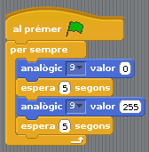

# 23 - Transistors i motors de CC

## Finalitat

L'ús dels **transistors** ens permet controlar un **motor de corrent continua**. Amb aquest component electrònic podem utilitzar una **entrada analògica** per a controlar el valor d'una **eixida analògica**.

## Material

|                                Imatge                                 | Descripció                                                           |
| :-------------------------------------------------------------------: | :------------------------------------------------------------------- |
|          | Arduino Uno o compatible amb S4A i amb el firmware per S4A carregat. |
|     | Una protoboard                                                       |
|         | Cables de connexió                                                   |
|            | Un díode led                                                         |
|       | Una resistència de 330 Ohms                                          |
|        | Un transistor 2N2222                                                 |
|  | Un potenciòmetre de 10k Ohms                                         |
|      | Un motor de corrent contínua                                         |

## Els motors de corrent continua

Fins ara hem utilitzat les eixides del nostre arduino per a influir en el món exterior governant únicament díodes LED. Hem pogut fer-ho perquè té capacitat suficient _(potència)_ per a encendre'ls.

Però existeixen molts altres components per als quals la capacitat del nostre arduino és insuficient: motors de CC, accionar relés...

Per a solucionar aquest problema tenim **els transistors**.

- _Els pins digitals de arduino permeten un màxim de 40 mA., o cosa que és el mateix, 5V x 40mA. = 0,2 W (Watts) de potència._
- _El pin de 5V pot donar fins a 0,5A si tenim el arduino connectat per USB._
- _Cal fixar-se bé a no connectar components que sobrepassen les especificacions del nostre arduino , o podríem acabar cremant-ho._

En aquesta lliçó utilitzarem la nostra placa arduino per a controlar un xicotet **motor de corrent continua.**

## Els transistors

Un **transistor** és un dispositiu electrònic **semiconductor** que serveix per a regular un senyal d'eixida en funció d'un senyal d'entrada. Si tornem a l'analogia amb el flux d'aigua, seria alguna cosa semblança a una aixeta o una clau d'aigua.

- _Tots tenim clara la diferència entre conductor i aïllant. Un semiconductor pot ser qualsevol de les dues coses en funció del que necessitem, a més de tindre algunes altres propietats molt útils._

Els **transistors** treballen bàsicament de dues formes _(encara que no són les úniques):_

- Permetre o tallar el flux de corrent a partir d'un xicotet senyal de comandament.
- Amplificar el senyal d'entrada.

Quan treballa de la primera forma, diem que treballa en **curt** (quan no passa) o en **saturació** (passa sense restriccions), però res de passar a mig fer. O cosa que és el mateix, curt és un 0 (FALSE) i saturació un 1 (TRUE). Això és el fonament de tota l'electrònica
digital moderna: ordinadors, consoles, telèfons...

També pot treballar en **activa**, deixant passar més o menys corrent.

Els transistors tenen tres parts: **Emissor**, **Col·lector** i **Base** (E, C i B). Seguint l'analogia de l'aixeta l'emissor seria l'eixida d'aigua, el **col·lector** l'entrada i la **base** el comandament. Ho veurem més clar en la següent figura.

- **Curt**: si no hi ha senyal en B, la vàlvula està tancada i no hi ha flux d'aigua entre C i E.
- **Activa**: si hi ha senyal en B, la vàlvula s'obrirà la vàlvula en funció del seu valor i permetrà el pas de part del corrent d'aigua de C a E.
- **Saturació**: si el senyal en B és suficient, la vàlvula s'obrirà completament i permetrà que tot el corrent d'aigua passe de C a E. Arribats a aquest punt, encara que li donem més senyal en B no aconseguirem major corrent, i fins i tot podríem trencar la vàlvula.

Si heu entés l'exemple, només heu de canviar corrent d'aigua per corrent elèctric, i la vàlvula pel **transistor** i comprendreu el seu funcionament.

- _Diem que funciona com a amplificador perquè amb un xicotet corrent en **la base** podem tindre un corrent molt major entre el **col·lector** i l'emissor ._
- _Es poden utilitzar diversos transistors per a aconseguir **guanys** molt grans._
- _Cada vegada que escoltes música, hi ha un o diversos transistors amplificant un senyal feble perquè pugues escoltar-la._

## Circuit amb transistor i motor cc

En aquest muntatge usarem el transistor d'ús general **2N2222**, barat i fàcil de trobar. Permet fins a 0,5 Amperes i 40V.

L'esquema elèctric seria el següent:

- Q1 és el transistor i M1 el **motor de CC**. La fletxa en Q1 indica la direcció del corrent.
- Connectem la **base** al pin 9 del nostre arduino .
- El **col·lector** el connectem a la presa de 5V de la placa, però podríem connectar-lo a preses de 12V, 24V etc... en funció de la potència de l'element que vulguem controlar i usar un transistor concorde.
- Connectem el positiu del motor a l'emissor , i el negatiu a terra.
- La fletxa de l'emissor indica la direcció del corrent i que és un transistor **NPN**, si la fletxa tinguera la direcció contrària seria un transistor PNP, però millor el deixem de moment
- Com podeu veure, hem col·locat un díode LED en paral·lel al motor. Ho hem fet per a protegir al transistor _(que és una mica més car que el díode, encara que no gaire)._ No entrarem en els detalls del per què en aquest curs, suficient amb què us sone si heu de realitzar més muntatges com aquest.

Una dels avantatges d'usar un transistor és que s'aïlla la part de control del circuit connectada a la base de la part de la càrrega entre emissor i col·lector, fent molt difícil que cremem el nostre arduino.

Per a saber quin pin és cada pota, posem el transistor amb la cara plana cap a nosaltres _(ací està retolat el model)_ i les potes cap avall. D'esquerra a dreta són emissor, base i col·lector.

En la protoboard el circuit quedaria de la següent forma:

## Programa de control del motor

Primer farem que treballe en el transistor en **curt** i **saturació**, canviant de l'una a l'altra cada 5 segons.

Per a controlar la velocitat de gir del motor mentre el transistor treballa en la part activa utilitzarem un programa similar al que usem en **la lliçó 9** de les eixides analògiques, però fent que puge i baixe el valor una mica més a poc a poc incloent dos blocs _de "esperar 0,1 segons"._

- _Si a simple vista no noteu la variació de velocitat podeu acostar l'oïda per a escoltar-lo o agafar-lo amb la mà per a notar com canvia la vibració._

## Utilitzant un potenciòmetre com a senyal de control

Us recomane tornar a realitzar aquesta lliçó però utilitzant un **potenciòmetre** per a usar el valor d'una entrada analògica per a variar la velocitat del motor. El muntatge seria molt senzill combinant el d'aquesta lliçó i el de la **lliçó 11** d'Entrades Analògiques.

L'esquema electrònic és el següent:

No posarem l'esquema de muntatge en la Protoboard, perquè ja hem vist com connectar tots els components del circuit en aquesta lliçó i en **la lliçó 9**. A més ja va sent hora **(si és que no ho feu ja)** que feu els muntatges usant l'esquema electrònic, que és molt més clar, sobretot a mesura que es van complicant els circuits.

La programació és molt senzilla, simplement assignem a l'eixida analògica el valor de l'entrada analògica a la qual està connectat el potenciòmetre.

- _Dividim el valor de l'entrada analògica entre 4 per a adequar-la a l'eixida i aprofitar tot el gir del potenciòmetre, de la mateixa manera que féiem en **la lliçó 11** amb l'escenari._
- _Recordeu que les entrades analògiques poden prendre 1024 valors i les eixides analògiques 256._

## Conceptes importants

- Coneixem el funcionament bàsic d'un **transistor**, i ja podrem usar-los sense por en qualsevol altre projecte.
- Hem utilitzat un xicotet **motor de corrent continu**, però ara sabem els principis necessaris per a controlar càrregues que el nostre arduino per si només no té capacitat _(potència)_ per a
  controlar.
- Sabem com usar una **entrada analògica** i adequar-la correctament per a controlar el valor d'una **eixida analògica**.

## Veure també

- [Index](../Index.md)
- [README](../README.md)
