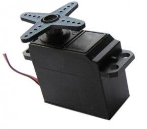
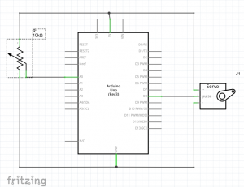
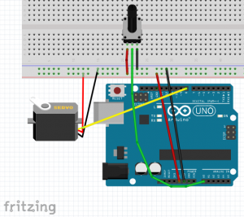
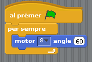
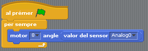
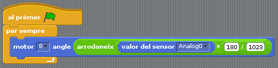
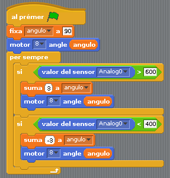

# 24 - Els servomotors

## Finalitat

Conèixer els **servomotors** o **servos**. Veure en què es diferencien d'un **motor** normal. Aprendre a manejar-los amb un **potenciòmetre** i amb un **joystick**.

## Material

|                                 Imatge                                 | Descripció                                                           |
| :--------------------------------------------------------------------: | :------------------------------------------------------------------- |
|           | Arduino Uno o compatible amb S4A i amb el firmware per S4A carregat. |
|      | Una protoboard                                                       |
|          | Cables de connexió                                                   |
|  | Un joystick                                                          |
|   | Un potenciòmetre de 10k Ohms                                         |
|           | Un servo amb els seus horns                                          |

## Què és un servomotor

Els motors de corrent continu que hem manejat fins ara giren contínuament a una velocitat determinada, que depén d'un senyal de control.

Un **servomotor**, o simplement servo, no gira de manera contínua, sinó que el que fem és controlar la seua **posició**.

Amb aquesta capacitat de moure's un **angle** concret i mantindre's ací podem crear tota classe de moviments d'una forma controlada; per exemple en braços robòtics, cotxes de radiocontrol o timons de vaixells i avions.

Normalment l'angle de gir d'un **servo** no és de 360°, sinó de 180° _(encara que també n'hi ha)_ i són de corrent continu.

Tenen 3 fils de connexió, 5V (roig), GND (negre o marró) i Control (groc o blanc). El senyal de control li la donarem connectant-ho a una de les eixides analògiques de la nostra placa Arduino.

## Servo i potenciòmetre

En aquest apartat controlarem el moviment del **servo** utilitzant un **potenciòmetre**, de la mateixa forma que l'hem utilitzat en altres lliçons.

Normalment el servo ve amb diferents hèlices que podem acoblar-li en funció de l'objecte amb el qual vaja a interactuar o del que vulguem aconseguir. El primer que hem de fer és caragolar qualsevol de les hèlices que tinguem en l'eix de gir per a poder observar bé el gir.

**S4A** té tres pins reservats per a ajudar-nos a manejar servos. Són els pins 4, 7 i 8. Tenint això en compte, l'esquema elèctric

i el muntatge en la Protoboard són molt senzills:

Per a controlar aqueixos pins especials usarem un nou tipus de blocs de la categoria _"Moviment"_ anomenats **_"motor ... angle ..."_**. Aquest bloc posiciona el servo en l'angle que li indiquem. Podeu provar-ho de manera molt senzilla amb aquest xicotet programa:

- Si variem l'angle veurem com el servo es mou fins a aconseguir la nova posició _(recordeu que el valor ha d'estar entre 0 i 180°)._

Com el que volem en què l'angle varie en funció de la posició del potenciòmetre hem de modificar una mica el programa:

Ací tindrem el mateix problema que ja ens ha sorgit més vegades. Com l'entrada analògica té un rang de 0 a 1023 i l'angle de 0 a 180°, la majoria del moviment del potenciòmetre no tindrà cap efecte.

Per a aprofitar tot el gir del **potenciòmetre** adaptarem els valors de l'entrada analògica als graus que pot girar el servo de la següent forma:

$$Angle = \frac{180}{1023} \times ValorEntradaAnalògica$$

D'aquesta forma quan en l'entrada connectada al potenciòmetre tinguem 0 l'angle serà 0° i quan estiga en el màxim 1023 serà 180°, i podrem aprofitar tot el rang de moviment del potenciòmetre.

## Servo i joystick

El que farem amb **el joystick** és sumar o restar graus a l'angle de la posició del servo en comptes de calcular directament l'angle. En cristià, en moure el joystick el servo girarà en l'una o l'altra direcció i mantindrà aqueixa posició quan el soltem.

L'esquema elèctric i el muntatge en la Protoboard són molt senzills, simplement canviarem el potenciòmetre pel joystick (ja hem vist com connectar-lo en **les lliçons 19 i 20**). Jo utilitzaré l'eix X del joystick.

El primer que farem és crear una variable _"angle"_ i fixar la posició inicial del **servo** a, per exemple, 90°.

De la mateixa forma que vam fer en **la lliçó 19**, crearem dues estructures condicionals per a saber si el joystick s'ha mogut cap a un costat o cap a l'altre, i sumarem o restarem a l'angle anterior un nombre de graus _(major com més ràpid vulguem que es moga)._

Si voleu continuar jugant amb el servo, podeu tractar de fer que el moviment del joystick siga analògic com hem fet en les lliçons anteriors, o que en pitjar el botó del joystick el servo es moga a una posició determinada.

## Conceptes importants

- Hem aprés què són i com funcionen els **servos**.
- Sabem controlar-los amb un **potenciòmetre** o un **joystick**, i podrem usar l'un o l'altre en funció del que necessitem per als nostres projectes.
- Hem adaptat una **entrada analògica** per a transformar-la en una eixida valor que vaja de 0 a 180º.

## Veure també

- [Contingut](../Contingut.md)
- [README](../README.md)
