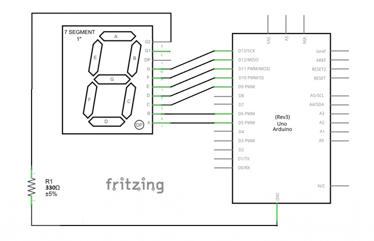
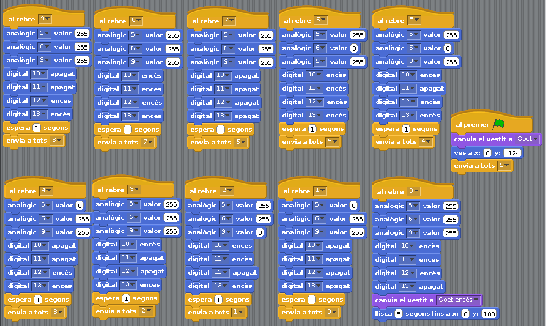

# 25 - Display de 7 segments

## Finalitat

Presentar els **displays 7 segments**. Aprendre a connectar-los i **programar-los**. Programar un **compte arrere.**

## Material

|                                Imatge                                | Descripció                                                           |
| :------------------------------------------------------------------: | :------------------------------------------------------------------- |
|         | Arduino Uno o compatible amb S4A i amb el firmware per S4A carregat. |
|    | Una protoboard                                                       |
|        | Cables de connexió                                                   |
|      | Una resistència de 330 Ohms                                          |
|  | Un display 7 segments d'1 dígit                                      |

## Els displays 7 segments

Si és la primera vegada que escoltem aquest nom pot ser que sone a una cosa molt complicada, però segurament tots els dies us creueu amb molts d'ells. Els podem veure per exemple, en els marcadors dels poliesportius, e els microones o en els rellotges digitals que hi ha per les ciutats. I és que un **display de 7 segments** no és més que això, 7 LED en forma de barra que ens serveixen per a representar tots els números d'un dígit. A més solen incloure també un punt, i a vegades 2.

La connexió d'aquesta mena de component electrònic pot ser diferent segons qui l'haja fabricat. A cadascun dels 7 segments se'ls adjudica una lletra per a poder identificar-los, des de la _"A"_ fins a la _"G"_, començant per la barra de més amunt i seguint en el sentit de les
agulles del rellotge.

- _Si teniu un altre model, el principi de funcionament serà el mateix, i només haureu de buscar informació sobre com es connecta en la pàgina del fabricant._
- _L'important és que sapieu quin pin del display correspon a cada segment, i quin es connecta a comú._

## Connexió i prova del display

El display té 10 pins, 5 en la part superior i 5 en la inferior. Col·locant el punt a baix a la dreta els pins es nomenen començant pel de baix a l'esquerra i en direcció contrària a les agulles del rellotge.

En aquesta figura podem veure la distribució dels pins i a quin segment correspon cadascun, a més del punt i la connexió a comú _(a través d'una resistència per a limitar la intensitat, com fem sempre amb els LED)._

És important tindre la distribució en ment quan anem a connectar-ho i fer-ho de la forma més ordenada possible perquè la programació siga més senzilla. Hem de saber en tot moment que eixida il·lumina cada segment, de manera que si, per exemple, volem mostrar un 1, posem **HIGH** els pins connectats a "B" i _"C"_, deixant els altres a LOW .

Per això, l'esquema **elèctric** que mostrarem a continuació no és obligatori, però sí que és la forma que a nosaltres ens ha semblat més senzilla. Si decidiu connectar-los en un altre ordre hauries de canviar també la programació. No posarem el muntatge en la Protoboard perquè serà un embolic més que una ajuda, i a més no tenim cap dubte que a hores d'ara teniu més que dominats els esquemes elèctrics.

- _Com en **S4A** només podem utilitzar 4 eixides digitals, i necessitem 7 per a aquest display, utilitzarem les eixides analògiques com si foren digitals._
- _Simplement utilitzarem el valor màxim 255 com HIGH i 0 com LOW._

I ara per a provar si ho hem connectat correctament, farem un programeta molt senzill que vaja encenc d'un en un i per ordre els Leds del 7 segments, des de la _"A"_ fins a la _"G"_.

Si hem connectat tot correctament, s'haurien d'anar il·luminant i apagant els Leds en ordre. Si s'encén algun que no esperàveu, haureu de comprovar de nou les connexions.

## Programant un compte arrere per a llançar un coet

Ara que ja tenim tot ben connectat, utilitzarem el **display 7 segments** per a simular un compte arrere per al llançament d'un **coet**. I el primer que farem és dibuixar un fons en l'escenari i crear un parell de disfresses, un per al coet en repòs i un altre per a
quan encenga els motors.

- _Us recomanem posar el centre de la **disfressa** en la part de baix del coet, perquè siga més senzill posicionar-lo després quan el programem._
- _Recordeu que això es fa des de l'editor en el qual dibuixem la disfressa._

A l'hora de programar, el primer que farem serà posicionar l'objecte i seleccionar la disfressa correcta. I una vegada fet això començarem el compte arrere utilitzant el bloc de control _"enviar a tots 9"_, que després usarem perquè en rebre-ho mostrem un 9 en el display durant un
segon.

I una vegada fet això ja podem començar a programar el compte arrere. Serà tan senzill com en rebre el missatge respectiu de cada número, encendre les eixides que siguen necessàries per a representar el número en el display. És important tindre al cap la distribució dels segments i
com els hem connectats al nostre Arduino, o en cas contrari ens costarà molt representar els números correctament.

Una vegada que tinguem clar quines eixides hem d'encendre i quins apagar farem que es mostre durant un segon i enviarem el missatge per a mostrar el següent número.

Ara ens queda afegir el llançament del coet, que serà tan senzill com afegir dues instruccions una vegada que hàgem arribat _a "0"_. Canviarem la disfressa a encesa i farem que el coet es moga en vertical fins al final de la pantalla, utilitzant la instrucció _"lliscar en ... segs a x: ... y: ..."._

I com sempre, us recomanem continuar jugant amb aquests **displays**, per exemple, podries afegir-li un polsador i crear un dau digital, de manera que cada vegada que el premeu mostre un número aleatori de l'1 al 6.

## Conceptes importants

- Hem aprés a utilitzar els **displays 7 segments.**
- Podem mostrar informació en l'exterior sense utilitzar l'escenari.
- Sabem programar un **compte arrere**.

## Veure també

- [Index](../Index.md)
- [README](../README.md)
