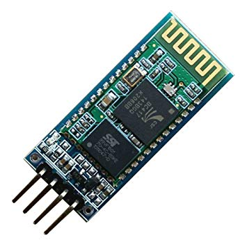

# 26 - El Bluetooth en S4A

## Finalitat

La darrera lliçó d'aquest curs ens permetrà executar programes de S4A en el nostre Arduino sense necessitat de cables. Per tant presentarem i configurarem el mòdul **buetooth HC-06.** D'aquesta manera aconseguirem comunicar l'entorn S4A en el PC i Arduino mitjançant **Bluetooth**.

## Material

|                                  Imatge                                  | Descripció                                                           |
| :----------------------------------------------------------------------: | :------------------------------------------------------------------- |
|             | Arduino Uno o compatible amb S4A i amb el firmware per S4A carregat. |
|   | Un mòdul Bluetooth HC-06                                             |
|            | Cables de connexió                                                   |
|      | Un alimentador                                                       |
|  | Un portapiles                                                        |

## Introducció

Si recordeu, en la introducció a S4A que vam fer quan comencem el curs, vam dir que una de les limitacions que té aquesta eina és que cal tindre sempre connectat el Arduino al PC perquè S4A puga comunicar-se amb ell i executar el programa que hàgem creat. I des de llavors no hem tornat a parlar d'això, donant per fet que només podíem resignar-nos i tindre-ho connectat contínuament amb un **cable**.

Per a els projectes que hem realitzat fins ara, això del cable tampoc era un inconvenient molt gran, menys encara en les sessions en les quals hem utilitzat l'escenari del S4A. Però si se'ns passa pel cap la idea de fer, per exemple, un robot tipus **Rover** _(com aqueixos que manem a
la Lluna),_ tindre un cable molestant per ací pot ser un enfarfec.

Bé, no mentíem quan déiem que la placa necessita estar connectat al PC, però això del cable té solució: el Bluetooth. Com bé segur que sabeu, el Bluetooth és una tecnologia que ens permet comunicar dispositius a distància sense necessitat de cables, present en els telèfons intel·ligents, tauletes, en els cotxes i en infinitat de dispositius electrònics.


I com no podria ser d'una altra manera, existeixen uns mòduls que es connecten al nostre Arduino i que ens serviran per a atorgar-li la capacitat de comunicar-se via Bluetooth amb altres dispositius que també suporten aquesta tecnologia.

Així que per a aconseguir el nostre propòsit necessitem un PC amb Bluetooth i un mòdul Bluetooth per al nostre Arduino.

## Arduino i els mòduls bluetooth

Sabem que nostres Arduino tenen un connector sèrie que utilitzem per a connectar-lo mitjançant un cable a l'USB del nostre PC, i que això ens permet tant enviar com rebre dades. No obstant això aquesta no és l'única opció.


Si ens fixem en els pins 0 i 1 de Arduino veurem que al costat hi ha escrit **Rx** i **Tx**. Què significa això? Doncs que aquests pins serveixen també per a realitzar la comunicació serie de la
mateixa forma que el cable que hem utilitzat fins ara. El pin 0 (Rx) s'encarrega de rebre dades i el pin 1 (Tx) de transmetre dades.

Així que si connectem el mòdul **Bluetooth** a aqueixos dos pins podrà transmetre les dades que arriben des d'altres dispositius Bluetooth al nostre Arduino, podent prescindir de cables. En
el nostre cas busquem rebre les dades que li arriben des d'un PC amb Bluetooth i que estiga executant **S4A**.



Hi ha diversos mòduls Bluetooth per a Arduino, i els més utilitzats són el HC-05 i el HC-06. Recomanem utilitzar el **HC-06** perquè és el més senzill de connectar i d'usar, i serà el que utilitzem nosaltres per a realitzar aquesta sessió.

El **HC-06** té 4 pins, dos per a l'alimentació com ja és costum, i dos per a comunicar-se amb el nostre Arduino, retolats com **Rx** i **Tx**. A l'hora de connectar-ho al nostre Arduino hem de connectar el Tx del mòdul al Rx del Arduino, i el Tx del mòdul al Rx del Arduino, de manera
que el que envie el mòdul **Bluetooth** el reba el Arduino i viceversa. Però de moment no connecteu res, ja explicarem per què.

Però abans de poder utilitzar-ho d'aquesta forma amb **el S4A**, haurem de canviar la configuració que té predeterminada en el HC-06.

## Configurant el hc-06 per a s4a

Per a configurar el mòdul haurem de tornar a utilitzar el **IDE de Arduino**, l'entorn de programació que s'utilitza normalment per a programar els Arduinos, i que utilitzem en la primera sessió del curs de S4A per a carregar el programa que ens permet usar S4A amb els nostres
Arduino.

Ara heu de obrir aquest arxiu, que conté el programa que configurarà el Bluetooth: **Configurar_HC-06_S4A.ino** o copiar el codi al final del document. El que fa el programa és canviar el nom i la contrasenya del Bluetooth perquè poseu la que vosaltres vulgueu, i configurar la velocitat de comunicació perquè siga la mateixa que utilitza el S4A i puguen _"entendre's"._

En el programa podeu canviar _"CARTROTECH"_ i _"1234"_ pel **nom** i la **contrasenya** que vulgueu que tinga el vostre dispositiu:

```Arduino

String nom = \"_CARTROTECH_\"; //Canviar _CARTROTECH_ pel nom desitjat

String password =\"_1234_\"; //Canviar _1234_ pel la contrasenya
desitjada

```

Una vegada fet això hem de carregar el programa en **Arduino**. Per a això no teniu més que prémer en la icona amb forma de fletxa, i esperar que en la part de baix us aparega la paraula _"Pujat"_.


I una vegada fet això haureu de desconnectar el cable de l'ordinador i connectar el mòdul **Bluetooth HC-06** de la forma que hem indicat anteriorment i que podeu veure en la següent imatge:


I ara sí, ja podeu tornar a connectar el cable de l'ordinador. Quan vegeu que s'encén el LED del Arduino que està connectat al pin 13 significarà que ja ha acabat de configurar-lo.

Una vegada configurat hi haurà que tornar a desconnectar el Bluetooth del Arduino i carregar el **Microprogramari** de S4A en el Arduino per a poder tornar a treballar amb S4A. Si no us recordeu com es feia o no teniu l'arxiu amb el Microprogramari guardat, tireu un ull **a la sessió** 01 en la qual expliquem com fer-lo.

- _Si us pregunteu al fet que ve tant connectar i desconnectar l'explicació és que mentre tinguem connectats els pins 0 i 1 del Arduino, la connexió serie mitjançant el cable no funciona i no ens permet carregar-li programes._
- _Per això desconnectem el mòdul per a carregar el programa, i una vegada carregat podem connectar el mòdul Bluetooth i tornar connectar el cable de l'ordinador perquè s'execute el programa i configure el HC-06._

I ja per fi podeu llevar el cable del PC, tornar a connectar el HC-06 i connectar el Arduino a la font d'alimentació.

## Utilitzant el bluetooth amb s4a


Per a connectar el PC en el qual executem **S4A** i el **HC-06** accedim a la configuració del **Bluetooth** del nostre PC i ací hauria d'aparéixer-nos el mòdul amb el nom que li hàgem posat. Ho seleccionem, escrivim la contrasenya que hem triat i esperem que s'aparellen.

Llavors obrim l'entorn **S4A** i si tot ha anat bé, després d'un moment d'incertesa, veurem com S4A detecta la placa. I ja per a acabar farem un programeta per a fer parpellejar el LED de la pròpia placa Arduino connectat internament al pin 13 per a assegurar-nos que tot estiga funcionant correctament. Veureu que S4A va una miqueta més lent a l'hora de seleccionar i col·locar els blocs, però gens important.

- _Fins ara hem utilitzat l'alimentació que li dona el propi cable que connectem a l'USB de l'ordinador i que serveix també per a la comunicació._
- _Però com precisament el que volem és no dependre d'aqueix cable necessitem una font d'alimentació externa._
- _Pot ser una font d'alimentació que es connecta a un endoll de la casa (com si fora un carregador de mòbil), una caixa d'alimentació per a piles o una bateria, i ha de tindre presa per a l'alimentació externa del Arduino._

Perquè si veieu que efectivament el LED parpelleja, enhorabona, perquè significa que tot ha anat bé i que tenim tot ben configurat. Podeu tornar a realitzar qualsevol de les sessions que hem vist fins ara i haurien de funcionar totes correctament. A partir d'ara utilitzarem aquest mòdul per a coses molt més divertides, començant per intentar fer un cotxe que puguem manejar a distància.

## Conceptes importants

- Podem utilitzar el **S4A** sense necessitat de cables, gràcies al **Bluetooth**.
- Coneixem una mica millor com funciona el nostre **Arduino**.
- Com connectar i configurar el mòdul **HC-06** perquè puga comunicar-se amb S4A.
- Hem realitzat un programa i comprovat que S4A l'està executant **sense cables** pel mig.

## Veure també

- [Index](../Index.md)
- [README](../README.md)

## Codi configura_hc06

```Arduino

#include <SoftwareSerial.h>

String nombre = "CARTROTECH"; //Cambiar CARTROTECH por el nombre deseado
String password ="1234";  //Cambiar 1234 por el la contraseña deseada

void setup()
{
  Serial.begin(9600);
  pinMode (13,OUTPUT);
  digitalWrite(13,LOW) ;
  Serial.print("AT");
  delay(1000);
  Serial.print("AT+NAME");
  Serial.print(nombre);
  delay(1000);
  Serial.print("AT+PIN");
  Serial.print(password);
  delay(1000);
  Serial.print("AT+BAUD6");
  delay(1000);
  digitalWrite(13,HIGH) ;
}

void loop()
{

}

```
